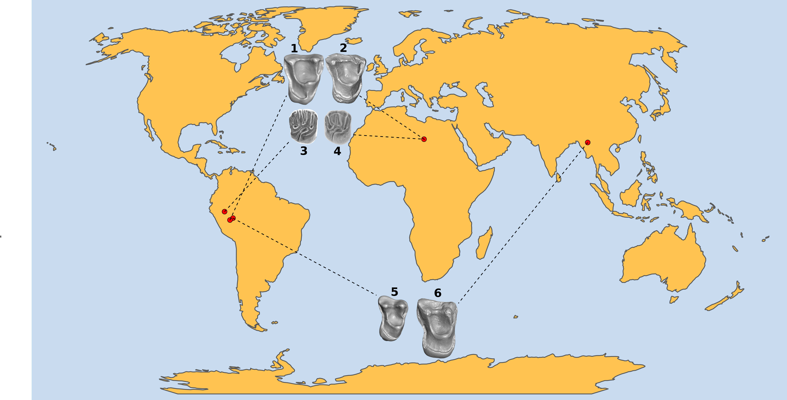
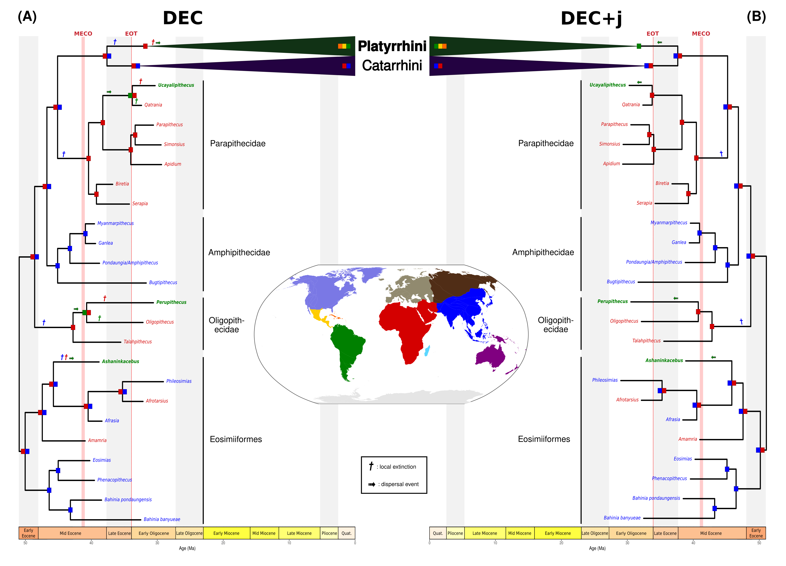

# General Discussion, Conclusions and Perspectives {header-title="General Discussion"}

```{r, echo=FALSE}
library(knitr)
```

## Summary of the contributions produced over this doctoral work

Over this thesis, several aspects of the evolution of South American mammals (SAM) across the Cenozoic have been explored, using a diverse array of data and quantitative methods.

First, attention has been dedicated to the extent to which Palaeogene SAM assemblages have been affected by the vast climatic disruption that occurred near the Eocene--Oligocene Transition (EOT, *ca*. 33.9 Ma). This geological boundary was indeed associated with significant waves of extinctions in the land mammalian faunas of the Northern Hemisphere. In South America, despite some considerations that a faunal turnover did occur near the EOT based on regional-scale qualitative observations from patagonian localities, until this thesis, no quantitative assessment of the status of the EOT at the continent-scale had ever been conducted in the framework of land mammals -- or, actually, any other taxonomic group. To this end, an unprecedented genus-level fossil occurrence dataset was assembled. This dataset was analysed using a Bayesian occurrence-based framework for diversification inference. Surprisingly, these analyses did not retrieve a strong extinction signal at the Eocene--Oligocene boundary. Rather, a gradual decrease in diversity was recovered during most of the Eocene, following the long-term climate cooling that operated from the Early Eocene Climate Optimum onwards. A significant ecologically-homogeneous turnover was however detected, but largely predating the EOT. A sustained positive relationship between the Andean uplift and SAM extinction rate was also evidenced over the study period, together with diversity-dependent effects. Finally, tropical and extratropical faunas were found to be tied to distinct evolutionary regimes, notably, with an absence of rate variation in the tropics. Overall, these findings suggest that the mass extinction status of the EOT from a global perspective should be reconsidered. Also, the findings produced over this study provided support for the long-standing 'Tropical Stability' hypothesis, stemming from the thoughts of A. R. Wallace in the late XIX century, thus contributing to the understanding of the evolution of the unique tropical diversity.

In a second chapter, some efforts were devoted to elucidate the evolutionary history of an endemic group of South American rodents that underwent a recent decline in taxonomic diversity, namely, the Chinchilloidea (Hystricognathi: Caviomorpha). This charismatic rodent superfamily today accounts for eight species, but its fossil record documents a much larger diversity in the past -- notably encompassing the largest rodents ever recorded, weighting up to 300 kg. Before this contribution, the causes behind chinchilloid evolutionary decline were uncertain, and despite several proposed hypotheses, had never been properely quantified. By means of an outstanding temporal occurrence dataset synthesising palaeontological and neontological data for 124 extinct and extant species and cutting-edge trait- and environment-dependent diversification methodologies, the macroevolutionary dynamics of Chinchilloidea were reconstructed. It stood out that chinchilloid diversification was best summarised by a birth--death model with constant speciation and time-variable extinction. Extinction rate indeed increased during the Late Miocene. This change in extinction regime was selective against large-sized and extratropical taxa. A prominent role of the Andean uplift and eustatic variations was highlighted in shaping chinchilloid extinction rate, possibly suggesting an implication of the Late Miocene vanishing of large South American wetlands in the demise of this clade. Additionally, this work highlights several caveats related to input data while conducting occurrence-based macroevolutionary analyses, and discusses the crucial need to embrace uncertainty.

In a final chapter, emphasis was placed on the asymmetry behind the Great American Biotic Interchange (GABI), a vastly enigmatic feature of this inter-american faunal exchange, in which North American taxa were undoubtedly more successful at colonising the South than the other way around. Using eco-evolutionary simulations coupled with high-resolution palaeoclimate reconstructions covering the last five million years, the contribution of palaeoclimate, often proposed as a major driver behind such an asymmetry, was mechanistically tested. These simulations failed to reproduce the empirical pattern of exchange asymmetry. When climate was the only factor constraining virtual species' niche, across 500-member simulations either starting from North or South America, more South-to-North than North-to-South exchanges were obtained, mostly within the tropical biome. This finding interestingly suggests that, beyond climate, additional factors must have shaped the striking imbalance behind the GABI. Over this chapter, the strengths of using a simulation approach to investigate the mechanisms underlying the emergence and the dynamics of biodiversity patterns are also discussed, notably as a means to circumvent the intrinsic biases of the fossil record, and an alternative view of the mechanisms behind the GABI is proposed, paving the way for further research to elucidate this mysterious macroecological enigma.

## A deep-time perspective on the Cenozoic history of South American mammals

### An almost closed system: founding migrations in the Palaeogene history of South American mammals {#sec-Mig}

As stated in @sec-SAFauna, the abrupt apparition of rodents and primates in the fossil record of South America -- long assigned to the Oligocene beds of the Deseado Formation, @fig-MapLoc -- made palaeontologists conclude that these clades were not present along with the ancestors of the 'Old-Timers' (*i*.*e*., metatherians, native ungulates and xenarthrans, @fig-persistence) when South America started its 'Splendid Isolation', but rather reached South America from another source continent [@simpson1950]. Although a pre-Oligocene age for this (or these) founding migration events rapidly established as a consensus[^discu-1] (@fig-SALMA), the origin of the ancestors of caviomorph rodents and platyrrhine primates has been much more debated. Meanwhile some authors argued that these most likely hopped islands from North America [*e*.*g*., @wood1959], others instead emphasised that they had an African origin [*e*.*g*., @lavocat1976]. In the early 2000s, the onset of molecular phylogenetics clearly established the monophyly of Caviomorpha and Platyrrhini, and invalidated the North American origin of these two clades [*e*.*g*., @huchon2001; @poux2006], already suggested by the absence of Eocene anthopoid and hystricognath remains on this continent, one of the best sampled in the world [@beard2006 and @fig-SpatBias]. Key contemporaneous and subsequent fossil discoveries in South America [@antoine2012; @bond2015; @seiffert2020; @marivaux2023], North Africa [*e*.*g*., @jaeger2010; @seiffert2005; -@seiffert2012; @marivaux2014] and South-East Asia [*e*.*g*., @beard1996; @chaimanee1997; -@chaimanee2012; @jaeger1999] (some of which being reported on @fig-aliens) provided compelling evidence in favour of an Afro-Asian origin for these two clades [*but see* @rosenberger2020].

[^discu-1]: Actually, an alternative model formulated by @seiffert2020 emphasises that these dispersal event(s) might have occurred later, at the Eocene--Oligocene transition (EOT), favoured by a global sea-level drop. This model would align with the early Oligocene age established by the same team for the Santa Rosa locality, that they propose to extend as a lower boundary to the Palaeogene localities of the region of Contamana and Shapaja [@campbell2021], the former including CTA-27, where the basalmost caviomorph rodents were discovered [@antoine2012]. The methodology applied by @campbell2021 to re-date the taxa from CTA-27, together with their interpretations, comprise a wealth of limitations, but such a discussion falls outside the scope of this thesis and will instead be the object of a study in itself. Here, we will just consider that, in the framework of rodents, this dispersal model tied to the EOT poorly explains the high degree of taxonomic differentiation found within several known early Oligocene rodent assemblages from the continent and the West Indies, including crown-group caviomorphs [*e*.*g*., @antoine2021; @bertrand2012; @boivin2018; -@boivin2019; @arnal2022; @marivaux_early_2020].

```{r, echo=FALSE}
#| label: fig-aliens
#| out-width: 17.5cm
#| fig-pos: "H"
#| fig-cap: "'Recent' dental evidence supporting an Afro-Asian origin of South American anthropoid primates and hystricognathous rodents. MicroCT-scanned teeth are represented, pointing towards the localities where they were unearthed. **1** shows the (reversed) left upper M2 of *Cachiyacuy contamanensis* (Rodentia: Hystricognathi), found at the CTA-27 locality (late middle Eocene, Peru), published by @antoine2012. **2** shows the left upper M2 of *Protophiomys durattalahensis* (Rodentia: Hystricognathi), found at the Dur-At-Talah locality (late middle Eocene, Libya), published by Marivaux & Jaeger in @jaeger_new_2010. **3** is the right upper M1 of *Perupithecus ucayalensis* (Anthropoidea: Oligopithecidae-like taxon), found at the Santa Rosa locality (early Oligocene, Peru), published by @bond2015. **4** is the (reversed) left upper M1 of *Talahpithecus parvus* (Anthropoidea: Oligopithecidae), found at the Dur-At-Talah locality (late middle Eocene, Lybia), published by @jaeger2010. **5** is the right upper M1 of *Ashaninkacebus simpsoni* (Anthropoidea: Eosimiidae), found along the Juruá river (?early Oligocene, Brazil), published by @marivaux2023. **6** is the right upper M1 of *Bahinia pondaungensis* (Anthropoidea: Eosimiidae), Yarshe Kyitchaung locality (late middle Eocene of the Pondaung Formation, Myanmar), published by @jaeger1999."



```

The means by which rodents and primates colonised South America have fascinated scientists for long, yielding to a vast array of hypothetical scenarios. Some pointed to a role of Antarctica as a transient landmass involved in a stepping-stone dispersal by the South [*e*.*g*., @houle1999; @huchon2001; @marivaux2002]. However, this dispersal through Antarctica would imply to cross zones not overlapping with anthopoid climatic suitability, and its timing (middle-to-late Eocene) would coincide with the onset of the Antarctic Circumpolar Current -- ultimately resulting in the glaciation of the continent at the Eocene--Oligocene Transition --, which may have acted as a barrier [@houle1999]. This hypothesis is therefore considered very unlikely. Others referred to stepping-stone dispersal along a suite of islands across the South Atlantic [*e*.*g*., @oliveira2009]. However, several evidence suggest that these islands (namely, the Walvis Ridge and the Rio Grande Rise) would more have acted as dead-ends rather than dispersal facilitators [@montheil2025]. As crazy as it may seem, long-distance overwater dispersal across the Atlantic, by means of natural rafts, is regarded as the most likely model to explain the colonisation of South America by hystricognaths and anthropoids [@houle1998; @marivaux2023; @montheil2025]. The most favourable time window for this spectacular trans-oceanic rafting was proposed to be the Middle Eocene Climatic Optimum (MECO, *ca*. 40.5 Ma), during which intense tropical meteorological episodes would have promoted riverbank break-ups in Africa, carrying away subsets of riparian communities including small-sized mammmals such as rodents or primates [@marivaux2023]. Palaeoclimate reconstructions suggested that westwards winds and currents were predominant in the Atlantic at that time, compatible with this unusual biogeographic scenario [@montheil2025 *and literature therein*]. It should be mentioned that long-distance trans-oceanic dispersal was shown to be the most likely scenario to explain the colonisation of Fidji Islands by iguanas [@scarpetta2025].

Things get even crazier considering that the fossil evidence available at the moment would be compatible with several overwater dispersal events, at least in the case of primates. Indeed, each of the three basal anthropoids described in South America (*Perupithecus*, *Ucayalipithecus* and *Ashaninkacebus*) has been assigned to distinct Afro-Asian families (Oligopithecidae, Parapithecidae and Eosimiidae, respectively), thus suggesting that the fantastic trans-Atlantic journey achieved by anthropoids was polyphyletic. Additionally, contrary to hystricognathous rodents for which the oldest South American remains are doubtlessly regarded as stem Caviomorpha [@antoine2012], the aforementioned three basalmost anthropoid lineages found in South America do not appear to be closely related to extant Platyrrhini, ultimately suggesting that a fourth primate lineage -- at the origin of the platyrrhine radiation -- made it to South America [@marivaux2023]. Whether a single founding raft carrying together all these primate lineages (plus hystricognathous rodents) or several rafts made it from Africa to South America is therefore not a trivial question to answer. However, as discussed by @marivaux2023, although the highly specialised dental morphology of *Ucayalipithecus* most likely makes this taxon part of a distinct radiation -- that turned out to become an evolutionary dead-end in South America -- , the transition from the basal dental anatomy of *Perupithecus* and *Ashaninkacebus* to that of recognised stem platyrrhines [*e*.*g*., *Dolichocebus*, *Branisella*, *Tremacebus*, *Chilecebus*, *Canaanimico*, but see @rosenberger2010 for an alternative placement of these taxa within crown Platyrrhini] is not improbable. For now, nesting the platyrrhine radiation in the evolutionary continuity of either *Perupithecus* or *Ashaninkacebus* cannot be achieved given the limited amount of available evidence (only a few isolated upper molars, no postcranial remains), emphasising the crucial need for additional field efforts in South America, particularly in tropical areas, to strengthen our understanding of the origins of the fascinating radiation of primates in South America (@sec-PalChal).

To shed some light on the issue of the timing and the possible number of dispersal events that led to the colonisation of South America by anthropoid primates, taking advantage of recent fossil discoveries and methodological advances, this thesis encompassed the supervision of a Master's project (see \textcolor{Blue}{Appendices}). The student, Frédéric Lozes-Méléro, reconstructed the most exhaustive total--evidence dated phylogeny of Anthropoidea, putting together morphological and molecular data for a large sample of extinct and extant anthropoid primates (\textcolor{Blue}{Appendices}, *Figure 1*). Studying the evolutionary history of platyrrhines with total--evidence dating was already achieved by @silvestro2019 and @beck2023. However, their sampling fraction was way more restricted than ours, particularly for non-platyrrhine groups -- absent from the former study -- yet essential to temporally anchor the arrival of primates in South America using phylogenetic divergence times (@fig-BiogeoPlaty).

Our reconstructions evidenced four phylogenetically-independent colonisation events of South America by primates, most likely occurring during different time frames (@fig-BiogeoPlaty). Meanwhile a colonisation of South America during the MECO, as suggested by @marivaux2023, would be compatible with the lineages of *Ashaninkacebus* and *Perupithecus*, the lineages of *Ucayalipithecus* and the one ultimately giving rise to Platyrrhini would be more compatible with a colonisation during the EOT, as suggested by @seiffert2020. Though their outputs cannot be compared in terms of which model best fits our data [@ree2018], both DEC and DEC+j attest for the same route for every lineages dispersing to South America, that is, across the Atlantic (@fig-BiogeoPlaty). This finding would invalidate scenarios involving other landmasses [*e*.*g*., Antarctica, @houle1999].

To complement these likelihood-based historical biogeographic reconstructions, we could take advantage of the flexibility of the Bayesian implementation of DEC in RevBayes developed by @landis2018. Moreover, these inferences relying on phylogenies might be nicely complemented by the use of occurrence-based frameworks for biogeographic history reconstructions, such as DES [@hauffe2022]. Despite the complementary nature of the information that they carry, few studies have conducted joint analyses of phylogenies and fossil occurrences to assess biogeographic hypotheses [*but see* @marion2026]. In addition, the isolation of South America at the time it was colonised by primates would make it relevant to test whether the platyrrhine radiation could (at least partly) match the predictions of the adaptive radiation theory in an insular framework [@simões2016]. In particular, provided we increase our catarrhine sampling fraction, it would be interesting to test whether the colonisation of South America was associated with higher diversification rates for platyrrhine with respect to their sister-clade, by means of Geographic State-dependent Speciation and Extinction models [*e*.*g*., @caetano2018; @goldberg2011; @landis2022].

To go further into the matter of the timing of the primate radiation in South America, it would be highly insightful to examine their diversification dynamics in relation to that of the other Palaeogene newcomers, namely, hystricognathous rodents. These two groups, currently represented by the endemic South American platyrrhine and caviomorph radiations, can be regarded as examples of evolutionary successes, accounting for 192 [@rylands2024] and 265 [@burgin2025] species, respectively. Contrary to other speciose Neotropical radiations [*e*.*g*., Sigmodontinae, @maestri2017], their diversification was accompanied with pronounced eco-morphological differenciations. For instance, both groups indeed show substantial body size variations. In platyrrhines, body mass ranges from 85-140 g for the pygmy marmoset (*Cebuella pygmaea*) to 12 kg for the Northern muriqui (*Brachyteles hypoxanthus*). In caviomorphs, as seen in @sec-chap3, body mass varies from 50 g for Kirchner's viscacha rat (*Tympanoctomys kirchnerorum*) to 50 kg for the capybara (*Hydrochoerus hydrochaeris*). In addition, caviomorph rodents exhibit a wide variety of lifestyles (*e*.*g*, semi-aquatic, fossorial, terrestrial) [@patton2015]. Although platyrrhines are all arboreal and may thus appear to be less differentiated than caviomorphs in terms of lifestyle, behavioural studies illustrated that platyrrhine species exhibited a wide spectrum of locomotor modes (*e*.*g*., climbing, leaping, use of prehensile tails, ...) [*e*.*g*., @fleagle1980; @mittermeier1981; @naas2025]. Was the success of these two radiations synchronous despite their marked eco-evolutionary distinctiveness? Did these two radiations respond to the same environmental factors? Can they be considered as adaptive? Do they conform to some of the predictions of @macarthur1967's seminal model of insular biogeography, as it has been suggested by @pino2025? Future research analysing and discussing the joint macroevolutionary dynamics of these two emblematic radiations, upon additional fossil discoveries to better untangle the early steps of their radiation (*cf*. the last paragraph of this section), may provide unprecedented insights into the mechanisms underlying continent-wise biological invasions over macroevolutionary timescales.

The phylogeny that was reconstructed over Frédéric Lozes-Méléro's project was prone to a number of limitations arising from conflicts between the information contained in the molecular and morphological matrices. In particular, the Bayesian framework used to reconstruct the total--evidence dated anthropoid tree [@ronquist_mrbayes_2012] could not handle multi-state morphological characters (MSC, *i*.*e*., polymorphic or uncertain characters, delimited by parentheses or brackets in the `.nex` file), treating them as non-attributes. This resulted in the loss of a substantial amount of phylogenetic information for taxa comprising several of these characters in the matrix. RoguePlots visualisation [@klopfstein2019] imposed us to exclude 10 out of the 59 fossil taxa initially incorporated to obtain a decently resolved phylogenetic reconstruction, but still, many of the tree, clock and substitution parameters did not achieve convergence across MCMC iterations (\textcolor{Blue}{Appendices}), thus challenging the reliability of any downstream interpretation. To circumvent the issue of MSC exclusion during phylogenetic inference, one solution often adopted by palaeontologists consists of resolving MSC by taking decisions on the basis of their expertise [*e*.*g*., @lihoreau2015]. However, this incorporates another layer of subjectivity, and ignores a substantial part of the information carried by MSC. More objective and statistically-robust incorporation of MSC in probabilistic methods for phylogenetic inference would therefore be a worthy methodological avenue to explore in the future.

Another thing that deserves to be recalled is that all these perspectives related to the origin of South American primates highly rely on the available data, and in particular, fossil material. The scarcity of the South American primate fossil record, both in terms of number of taxa described and of completeness of these taxa (often restricted to isolated dental remains) inevitably challenges their subsequent phylogenetic placement. As stressed by @marivaux2023, it is not improbable that the key behind the origin of the extant New-World primate radiation lies in either *Ashaninkacebus* or *Perupithecus* (even maybe both), but that, at the moment, the available fossil record for these two taxa does not allow us to draw such a relationship and to eventually root the platyrrhines in the evolutionary continuity of one of the basal anthropoid clade depicted on @fig-BiogeoPlaty. This reinforces the need for additional field expeditions to improve our understanding of the enigmatic origin of South American anthropoid radiation(s).

```{r, echo=FALSE}
#| label: fig-BiogeoPlaty
#| out-width: 18cm
#| fig-pos: 'H'
#| fig-cap: "Basal anthropoid historical biogeographic reconstructions carried out from the most complete total--evidence dated phylogeny of the clade reconstructed so far (adapted from Frédéric Lozes-Méléro's MSc Thesis, see \textcolor{Blue}{Appendices}). The world was divided into 11 biogeographic regions, indicated by colours on the map at the centre of the figure. Colours on the nodes show all the areas occupied by the corresponding ancestral lineage, without dinstinction. On the left (**A**) is shown the output of the Dispersal-Extinction-Cladogenesis (DEC) model [@ree2008], and on the right (**B**) is shown the output of DEC allowing for jump dispersal events [namely DEC+j, @matzke2014]. We only highlighted local extinction and dispersal events among lineages that ultimately colonised South America. As the aim of this figure was to infer the basal (Palaeogene) biogeographic events that lead to the colonisation of South America, the two extant anthropoid radiations, namely, the Catarrhini and the Platyrrhini, are not depicted in detail. South American taxa/groups are shown in bold."


```



### If climate didn't, what drove the asymmetry of the GABI?

The findings produced over @sec-chap3 indicate that the asymmetry of the GABI cannot be viewed as a sole consequence of palaeoclimate dynamics, thus offering little support to the climate-driven asymmetry hypotheses (@fig-hypotheses). This therefore leaves the mystery of the forces behind the asymmetry of the GABI entirely open; if climate cannot be mechanistically regarded as such, what may have caused this biogeographic imbalance?

Acknowledging that "the ultimate factors [behind the asymmetry of the GABI] have not been and probably cannot be designated", @simpson1950 proposed that the asymmetry of the GABI arose as a consequence of an inter-continental imbalance in exposure to external competitive pressures, shaped by the distinct biogeographic histories of the two continents. According to him, the fact that intermittent connections between North America and Eurasia emerged during the Neogene imposed a "series of competitive episodes" involving mammal lineages of these two continents. As a result, at the onset of the GABI, North American mammal faunas would have been exclusively composed of competitively "successful" lineages. On the other hand, SAM faunas had evolved in a vacuum over most of the Cenozoic (@sec-SAFauna), almost without being exposed to any sort of competitive pressure exerted by a foreign lineage (but see @sec-Mig). Competition has therefore been a long-standing paradigm to explain the asymmetry of the GABI. Recent evidence from stable isotopes suggested that North American lineages occupying different trophic levels (primary or higher consumers) had broader niches than South American lineages, which could have spurred their successful settlement in South America [@domingo2020]. On the other hand, the competitive exclusion hypothesis was intensively examined in the Sparassodonta, an emblematic South American metatherian predator clade, often assumed to have been outcompeted by North American carnivores as these migrated to the South, and evidence from quantitative analyses of their fossil record challenged the role of clade competition in underlying their demise [*e*.*g*., @freitas-oliveira_no_2024; @lópez-aguirre2017; @tarquini2022; @prevosti2024].

Beyond competition, other biotic-driven hypotheses for the asymmetry of the GABI also refer to predation, emphasising a pre-existing predatory regime disequilibrium between the Americas. Once the continents were connected, this predatory regime disequilibrium would have benefited to the North American predatory migrants (*e*.*g*., felids, canids), to the detriment of the South American lineages that were not used to cope with intensive predatory pressure (*e*.*g*., sloths, native ungulates) [@faurby_asymmetry_2016].

The role of biotic interactions -- being either competition or predation -- in the asymmetry of the GABI remains untested from a mechanistic perspective. Future research could therefore involve to adapt a simulation framework such as the one implemented over @sec-chap3 by incorporating biotic constraints to species ecological niche. The flexibility offered by gen3sis, the mechanistic eco-evolutionary simulator that we used, offers a vast array of possible ways to do so [@hagen2021; -@hagen2023]. In addition, it would also be possible to test for a synergy between biotic and abiotic factors by implementing an environmental filtering function depending on the diversity of other species and one or several palaeoclimatic variables at the same time [*e*.*g*., @hagen2024]. That being said, establishing a new simulation landscape to model the GABI would greatly benefit from leveraging the numerous caveats that our pipeline comprised (@sec-GABI_lim).

Future improvements in mechanistic modelling of the GABI may notably require to extend beyond the last 5 million years, a time frame that we adopted for practical reasons -- *i*.*e*., the temporal coverage of the palaeoclimate reconstruction that we used [@barreto2023]. Although experts generally agree with an onset of significant land mammal exchange between the Americas being not earlier than *ca*. 3 Ma, the fossil record attests for the occurrence of earlier faunal exchange, notably among sloths (South-to-North, *ca*. 9 Ma), procyonids and cricetids (North-to-South, *ca*. 7 Ma) [*e*.*g*., @woodburne2010].

Should such a temporal extension be applied, the assumption of fixed palaeogeography on which the simulation landscape used across @sec-chap3 relied could no longer be maintained. Consequently, future works would crucially require the development of fine-scale time-continuous palaeogeographic reconstructions of the isthmus of Panama. The timing of such a closure has been much debated in the literature, with various sources of data sometimes resulting in contrasting interpretations [*e*.*g*., @bacon2015; @lessios2015; @marko2015; @montes2015; @odea2016; @jaramillo2018; @brikiatis2023]. To accommodate for a spatio-temporal uncertainty regarding the evolution of this geologically-complex area in downstream eco-evolutionary simulation studies, one avenue could involve to assemble various palaeogeographic scenarios, notably varying in the timing of the full closure of the isthmian region. Such a reconstruction might have broad implication, as it may also be used as a building-block for any study interested in reconstructing the historical biogeography of a clade related to Central/South America -- among the most species-rich regions of the globe[^discu-2].

[^discu-2]: The perspectives developed here, *i*.*e*., building a fine-scale time-continuous palaeogeographic reconstruction of the Istmus of Panama and subsequently using it in a simulation framework to test for the effect of biotic interactions in the establishment of the asymmetry of the GABI were formalised in a post-doctoral proposal currently under consideration.

All in all, the GABI remains a mysterious biogeographical event that, despite being the scope of intensive research efforts over the past 50 years, will probably remain unresolved for long. Thirty years after publishing the cornerstone essay to which we refer earlier in that section [@simpson1950], Simpson wrote that the history of SAM "can be considered as an experiment without a laboratory, fortuitously provided by nature" [@simpson1980]. The term 'fortuitous' here adds an insightful perspective related to contingency, having a strong reasoning in the framework of the GABI : if things were to be repeated, perhaps the outcome would be different. Following that reasoning, we could even flirt with provocation and argue that the quest for the factors that underlay the GABI is vain. Maybe it entirely arose as a by-product of consecutive stochastic event that, taken as a whole, caused the demise of many endemic South American clades, to the advantage of North American ones.

Last, it is important to mention that, instead of being a consequence of the GABI, the relatively recent (Holocene) extinction of several emblematic endemic South American taxa (*e*.*g*., the native ungulate genera *Toxodon* or *Macrauchenia*; giant sloths; glyptodons) may also be regarded as a causality of Quaternary megafaunal extinctions [@croft2020]. The causes behind this well-described and intensively studied pattern remain under debate, but anthropogenic factors have been increasingly considered in that respect [*e*.*g*., @boscaini2025; @hauffe2024; @prates2021; @svenning2024].

### Future directions towards an improved understanding of the evolutionary history of South American mammals {#sec-FutureDir}

One of the core aims of this thesis was to untangle the most likely environmental drivers that fashioned SAM biodiversity across evolutionary times. Palaeotemperature, diversity-dependence and the Andean uplift were identified as good candidates for Palaeogene faunas, and their effects were shown to be time-heterogeneous (@sec-chap1). In addition, the astonishing Late Miocene decline of Chinchilloidea was shown to be tectonically- (via the Andean orogeny) and eustatically-controlled -- possibly through the demise of Miocene megawetlands. The role of the Andean uplift, evidenced over these two chapters, was frequently illustrated by studies investigating the macroevolutionary dynamics of a wide array of South American clades, such as notoungulates [@solórzano2024], sparassodonts [@pino2022; @tarquini2022], sigmodontine rodents [@vallejos-garrido2023], frogs and lizards [@boschman2022], hummingbirds [@mcguire2014] and several plant clades [@hoorn2023 *and literature therein*]. Producing an integrative synthesis of the drivers that underlay South American mammal diversification over the last *ca*. 23 million years (*i*.*e*., after Palaeogene times, thus in the continuity of the work that we conducted for @sec-chap1) was initiated over this thesis, by means of environment-dependent diversification analyses applied to an important occurrence database (see \textcolor{Blue}{Appendices}, *Poster*). However, this preliminary work would benefit from additional taxonomic revisions (see @sec-brush) -- particularly caviomorph occurrences, accounting for *ca*. 20% of the total dataset -- that we could not conduct until now for a matter of time.

Rather, we centered our efforts on the superfamily Chinchilloidea, producing the most precise and complete vetted temporal occurrence dataset elaborated for this clade, intensively analysed over @sec-chap2. Before scaling up our analytical framework to all South American mammals, a natural continuity of both @sec-chap1 and @sec-chap2 could be to conduct a similarly-intensive cleaning of the available non-chinchilloid caviomorph occurrences, *i*.*e*., assigned to the superfamilies Octodontoidea, Cavioidea and Erethizontoidea. The subsequently assembled database could further be analysed, in conjunction with available phylogenetic information (*e*.*g*., @fig-ExtSampl) to illuminate the most likely biotic and abiotic forces that spurred the diversification of caviomorph rodents during the Neogene and Quaternary. In the continuity of @sec-chap2, the question of the interplay between species diversity and morphological disparity, particularly under the lens of body size would be highly insightful to upscale to the entire Caviomorpha. The coordinated Middle Miocene evolution towards large body sizes that we exemplified in independent chinchilloid lineages (Dinomyidae and $\dagger$Neoepiblemidae) was indeed also recorded in several lineages of Cavioidea, ultimately making it interesting to contrast the interplay between diversity and disparity described in these two superfamilies, along with how palaeonenvironmental dynamics mediated these unique macroevolutionary pathways[^discu-3].

[^discu-3]: The perspectives of upscaling the questions of @sec-chap2 to the entire Caviomorpha developed in this paragraph have been formalised in a post-doctoral proposal submitted to an organisation attached to the University of Montpellier in January 2026. I was informally told that this project has not even been considered by the jury, who favoured candidates applying for projects outside the physical environment of their PhD -- which was nowhere indicated in the submission guidelines. *Oui, j'ai le seum*.

## Dealing with the Devil: data and methodological limitations to the large-scale study of clade diversification

### Detecting the legacy of environmental change in the dynamics of clade diversification

The idea that environmental changes affect the dynamics of clade diversification is central to the field of macroevolution, usually exemplified by the Red Queen and the Court Jester models, relating the pace of clade diversification to biotic and abiotic factors, respectively [@barnosky2001]. As detailed in @sec-macroevol, over the last decade, substantial methodological improvements have provided the means to elucidate the interplay between environmental dynamics and clade diversification, with the onset of environment-dependent diversification (EDD) models [*e*.*g*., @condamine2013; @lehtonen2017; @palazzesi2022; @hauffe2024]. As recalled in @sec-FutureDir, over this thesis, this family of models applied to occurrence data has allowed us to relate the dynamics of South American mammal diversification to several environmental factors, such as the pace of the Andean uplift, palaeotemperature or eustatic variations.

The immense majority of studies applying EDD models to phylogenies have usually adopted the same model selection philosophy to decipher environmental correlates behind diversification dynamics, asking, given a set of different models (*e*.*g*., constant-rate birth--death, temperature-dependent, diversity-dependent, ...), which one best fits the observed data [*e*.*g*., @campana2026; @condamine2018; @condamine_climate_2019; @lewitus2018; @toussaint2025]. As for occurrence-based methods, the usually-applied EDD frameworks (*i*.*e*., the MBD model, @lehtonen2017 or, more recently, the BDNN model, @hauffe2024) directly offer the possibility to assess for the individual contribution of each of the tested variables, and to further test for the significance of these contributions in a flexible Bayesian framework, thus leveraging the need for model comparison as done for phylogeny-based studies [*e*.*g*., @guo2023; @jouault_multiple_2022; @neubauer_drivers_2022; @weppe2023]. However, to our knowledge, whether these 'best' models actually fit the data *well* has remained poorly considered. In other terms, when testing for the effect of environmental variables on the dynamics of clade diversification, model selection procedures have mainly relied on maximising the relative fit between different models, but without drawing attention on the absolute fit of the models to the data.

The absolute goodness-of-fit of a model, also called model adequacy, has been a well-characterised concern in the field of phylogenetics and molecular evolution for several decades [*e*.*g*., @gatesy2007; @reeves1992]. @sullivan2005 summarised two statistical approaches to assess model adequacy, both relying on simulations. The parametric bootstrap test, first formalised by @goldman1993, consists of estimating the maximum-likelihood (ML) set of parameters ($\theta^*$) associated with a tested model ($\mathcal{M}$, for instance, a temperature-dependent diversification model). Then, $\mathcal{M}$ parameterised with $\theta^*$ is used to produce a number of replicates of simulated data (*e*.*g*., phylogenetic trees), and $\mathcal{M}$ is fitted to each replicate using ML. The subsequently-derived likelihoods associated to each replicate altogether form the expected distribution of how $\mathcal{M}$ with $\theta^*$ as parameters should fit any data. If the empirical likelihood (*i*.*e*., the ML of $\mathcal{M}$ fitted to the empirical dataset) falls outside this distribution, then we can say that the model is not adequate to explain the empirical data (*i*.*e*., does not fit the data well). The main limitation of parametric bootstrap tests is that they all rely on a point estimate of parameter values ($\theta^*$), and thus do not account for uncertainty around model parameters. To circumvent this limitation, predictive posterior simulations have been introduced [@bollback2002]. This approach uses Bayesian inference to estimate posterior distributions of the parameters of a model $\mathcal{M}$ given an empirical dataset. Then, $\mathcal{M}$ is used to simulate datasets, with parameter values drawn from their empirically-derived posterior distributions. The subsequently obtained simulated datasets are then compared to the empirical data using test statistics relying on given features: the closer they are, the more adequate $\mathcal{M}$ is considered. Predictive posterior simualtions recently proved successful to chose adequate models of morphological evolution during phylogenetic inference [*e*.*g*., @mulvey2024]. Future research may greatly benefit from expanding the model-adequacy perspective in the framework of EDD, so far much neglected [*but see* @etienne2016].

Additional avenues to investigate the legacy of environmental change in the dynamics of clade diversification may also incorporate the joint use of several approaches instead of solely relying on classical EDD models. Valuable complementary frameworks to EDD that could not be investigated over this thesis include causal inference frameworks, such as structural equation models [*e*.*g*., @hair2021; @ullman2012] or phylogenetic paths analyses [*e*.*g*., @gonzalez-voyer2014; @vonhardenberg2013] -- the latter accounting for the non-independence between the lineages analysed due to shared ancestry. The power of these approaches lies in that they provide the ability to assess for directional effects between extinction and speciation rates and a user-provided set of predictor variables. These effects may be direct or indirect, and their importance is jointly assessed. Such frameworks provided insightful perspectives on the drivers underlying the diversification of a diverse array of groups, such as Merianieae (Magnoliidae: Melastomataceae) [@dellinger2024] or Parnasiinae (Lepidoptera: Papilionidae) [@hevin2026_phd]. The main drawback of this kind of frameworks is that the user may specify *a priori* all the effects that are being assessed, this family of models indeed not being able to draw the relationships between the variables by itself.

### The brush is not only for the field: on the value of conducting expert-informed transparent occurrence data cleaning prior to any quantitative palaeobiological analysis {#sec-brush}

Over the past few decades, the increasing interest for studying large-scale biodiversity patterns has stimulated substantial efforts towards centralising massive amounts of biodiversity-related data (*e*.*g*., observations/occurrences, trait measurements or genetic sequences) in publicly-available databases. Since the very beginnings of the discipline, macroevolution has greatly benefitted from such large compilations, famously exemplified by the *Treatise on Invertebrate Paleontology* [*e*.*g*., @newell1952] or Sepkoski's genus-level compendium of marine animals [@sepkoski2002]. The late 1990s--2000s saw the onset of the modern fossil occurrence databases used on a day-to-day basis by a myriad of quantitative palaeobiologists, us first. Among the most famous are the Paleobiology Database [PBDB, @uhen2023], Neotoma [@williams_neotoma_2018], NOW [@community2020] or Neptune [@lazarus1994]. Along with these developments, concerns were expressed by palaeontologists spotting a number of errors in the occurrences related to their groups of expertise in these databases [*e*.*g*., @campbell2014; @prothero2015]. These errors[^discu-4], having to do with taxonomic name invalidity (*e*.*g*., typos, missing open nomenclature elements, outdated taxonomy), incompleteness[^discu-5] (*i*.*e*., missing published or unpublished specimens) or temporal and geographical range inconsistencies, ultimately suggested that using these databases requires preliminary taxonomic knowledge on the focal group to be able to fix them [@prothero2015], by conducting what is routinely known as 'data cleaning'.

[^discu-4]: As greatly recalled by @jones2025, these errors mostly result from the fact that these databases are maintained by a few amount of people often lacking the necessary (financial and human) resources to correct errors in the records or to avoid the propagation of new ones.

[^discu-5]: It is worth mentioning that the quantity of data entered in these databases increases each year. As it happens, with *ca*. two millions of stored occurrences, the PBDB grew up by almost 25% since 2023 [@uhen2023]. Consequently, one could expect incompleteness-related biases to be attenuated with the years, though there is still a long way to go before all the fossils unearthed so far end up within these databases. In that respect, a recent study evaluated that accounting for unpublished data stored in the museums (known as 'dark data') substantially impacted quantitative palaeobiological analyses [@dean2025].

Despite the few studies that intended to point the caveats of the data stored in open databases (see previous paragraph), the extent to which cleaning occurrence data impacts quantitative palaeobiological frameworks remains poorly explored. Using cheilostome bryozoans as a case study, @moharrek2022 evidenced that occurrence-based diversification rate shifts varied in timing and magnitude depending on the input data, in particular, whether "unedited" occurrences from the PBDB were analysed, or whether this initial data was subsequently revised and completed by experts. More recently, @marion2025_phd highlighted that estimates of clade age for the shark order Squaliformes significantly differed when relying on raw PBDB occurrences or a manually-assembled dataset after careful examination of the literature conducted by an expert. Interestingly, the differences in diversification patterns estimated from the two datasets that they reported depended on the taxonomic scale at which the data was analysed (*i*.*e*., genus *vs*. species): while genus-level diversification patterns were roughly similar, species-level ones exhibited marked differences. During the @sec-chap2 of this dissertation, we evidenced that our occurrence-based inferences of chinchilloid diversification markedly differed depending on the way we incorporated extant lineages (@fig-2s2), and also whether we accounted for the recent taxonomic revision of a hyperdiverse fossiliferous deposit (@fig-2s12). These sparse lines of evidence ultimately pinpoint the necessity of conducting occurrence cleaning to increase the accuracy of macroevolutionary reconstructions, highlighting the extent to which the outcome of such reconstructions may differ depending on the input data treatment.

To our knowledge, the sensitivity of environment-dependent diversification models -- extensively applied over this doctoral work (*e*.*g*., @sec-chap1 and @sec-chap3) -- to taxonomic cleaning has never been explicitly assessed. Similarly, the performance of the deep-learning based framework to infer diversity-through-time trained with simulated data implemented in DeepDive [@cooper2024], supposedly more powerful to cope with the biases related to fossil data, remains to be tested. These may be interesting research avenues to conduct in the future.

One issue arises as cleaning occurrence data is intrinsically subjective, because it relies on decisions motivated by the expertise of the people conducting the cleaning. Thus, at the era of reproducible research [@wilkinson2016], documenting cleaning procedures may not be straightforward. For instance, over this doctoral work, we intended to document as many of the occurrence cleaning steps as we could (*e*.*g*., @sec-ManClean, @sec-ManClean2), but we are aware that the transparency of our cleaning pipelines could be greatly improved. Since documenting cleaning steps literally doubles the time it takes to clean an occurrence, it may be tempting -- or just more convenient by lack of time -- not to explicitly report all the changes made during the cleaning process. In addition, in our case (especially for @sec-chap1), the multiplicity of actors involved in the cleaning process and the absence of clearly-defined upstream guidelines for common cleaning practices -- which is entirely my fault -- made it hard to document all cleaning steps. Over the past few years, substantial improvements towards reproducible cleaning pipelines have been made [*e*.*g*., @flannery-sutherland_fossilbrush_2022; @jones2023; -@jones2025]. All in all, we argue that occurrence data cleaning involving taxonomic expertise is essential when carrying out quantitative analyses of the fossil record, and that, for transparency, this critical step should be achieved following an already-established protocol which may incorporate the use of these newly-developed standardised tools. However, @marion2025_phd evidenced that, in the case of squaliform sharks, the exclusive use of automated cleaning tools, absent of manual occurrence data revision, exerts only a minor influence on macroevolutionary reconstructions relative to those based on raw open database data. Consequently, these tools should be only viewed as facilitators, and should never substitute any downstream manual occurrence revision.


