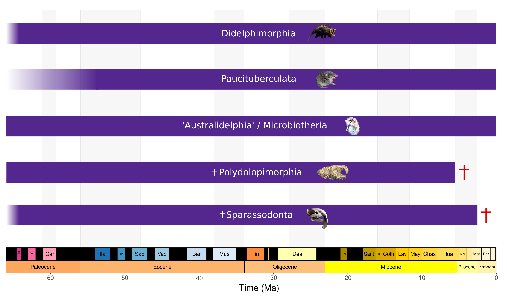
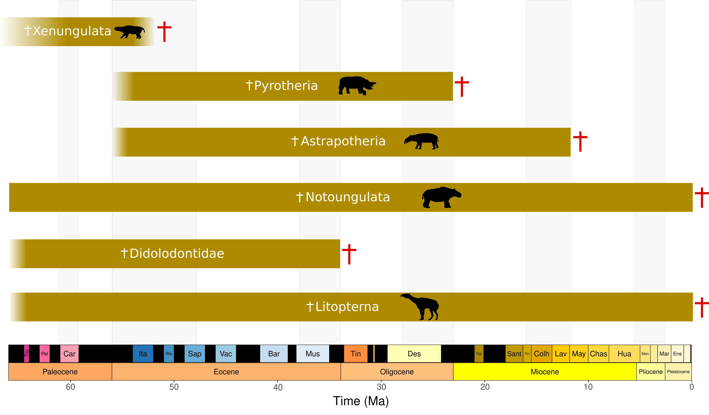
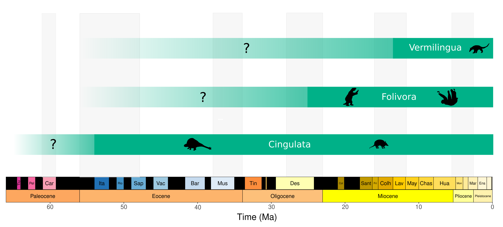

\pagenumbering{arabic}

# General Introduction {header-title="General Introduction"}

## The unevenness of biodiversity: corner stone for the large-scale study of life

```{r, echo=FALSE}
library(knitr)
```

The astonishing diversity of life on Earth has fascinated scientists for centuries. A study dating back to 15 years ago indeed estimated that around 8.7 million eukaryotic species are currently coexisting on our planet [@mora2011]. This number would probably be significantly increased by accounting for the substantial improvements that have occurred in the field of systematics over the recent years, and expanded by orders of magnitude if prokaryotic species were incorporated. Yet, someone travelling to the Sahara desert would probably be less amazed by the surrounding diversity of life than someone travelling to the middle of the Amazonia, one of the most species-rich regions in the world [@raven2020]. Another vertiginous data is that around 99.9% of the species that ever existed since the dawn of life on Earth, some 4 billion years ago, has gone extinct [@raup1986]. It therefore stands out that, far from a fixed and smooth entity, biodiversity, here understood as species richness, presents a myriad of heterogeneities, that stimulated a vast quantity of research works in which this thesis happens to be nested.

### The heterogeneous organisation of life across space {#sec-SpatHetero}

For more than two centuries, it has been recognised that species are not randomly distributed on Earth. In his pioneering "*Essai sur la géographie des plantes*", regarded as foundational for the science of Biogeography (see \textcolor{Blue}{Glossary}), Alexander von Humbolt emphasised the spatial nature of plant taxonomic assemblages [@humboldt1807]. Later in the 19$^{th}$ century, the scientific community acquired a uniquely integrated perspective on biodiversity fed by years of field observations, giving to the question of the spatial organisation of life on Earth a new dimension. Consequently, it has been proposed to subdivide the world into spatial units sharing similar fauna/flora, sometimes called 'Homozoic Belts', 'Regions', 'Realms', 'Provinces', 'Areas' or '*Gebiet*' (German word for territory, area) [@burkill1943]. The history will mainly remember the efforts of Alfred R. Wallace in that respect, who relied on the subdivision made by Philip L. Sclater in 1874 based on mammals, as well as his own expertise, to establish the famous contouring of the Earth's 'Zoogeographic Realms' (@fig-WallaceMap), two years after [@wallace1876]. Further efforts towards incorporating fossil evidence to better constrain the aforementioned subdivisions have to be acknowledged, notably implused by Richard Lydekker [@lydekker1896]. Wallace's subdivision has maintained in the field since its publication, and only received minor updates in the last decade [@holt2013], illustrating the degree of knowledge advancement of the English naturalist, in a context where Charles Darwin's famous Theory of Evolution -- that, actually, Wallace co-discovered in a totally independent manner, making such a theory one of the most striking examples of thought convergence in the history of sciences [@berry2008] -- still had a long way to go before being formally accepted by the broad scientific community.

```{r, echo=FALSE}
#| label: fig-WallaceMap
#| out-width: 15cm
#| fig-cap: Biogeographic map based on faunal similarities within animal assemblages across space ('Zoogeographic Realms') proposed by @wallace1876. 

include_graphics("./Figures/Wallace_1876-Zooregions_map.pdf")

```

Beyond its spatial organisation into units of shared taxonomic composition, biodiversity also exhibits a striking latitudinal organisation, in which species richness increases with decreasing latitude, known as the Latitudinal Biodiversity Gradient (@fig-maps). Such a pattern was already recognised by Humboldt. According to him, low-latitude plant tropical assemblages would be essentially made up with a large number of different species per unit of area, each having a relatively low density ("isolated and sparse"). Conversely, higher-latitude temperate or cold assemblages would be characterised by a substantially lower species richness per unit of area, with a single dominant species being over-represented ("excluding \[...\] heterogeneous species") [@humboldt1807]. Half a century later, in his cornerstone book "*The Origin of Species*", Darwin dedicated two chapters to the spatial distribution of species, recognising that many groups harbour a greater diversity in the tropics and seeking for potential mechanisms underlying this pattern [@darwin1859]. Today, though notable exceptions exist (*e*.*g*., pinnipeds, lagomorphs or several kinds of fungi), a latitudinal diversity gradient has been recognised among most taxonomic group (*e*.*g*., plants, insects, molluscs, vertebrates) [@hillebrand2004], as depicted on @fig-maps for three vertebrate classes.

Hence, biodiversity is largely heterogeneous across space, raising questions that have been thoroughly investigated in the past, as to 'Why are there more species in the tropics than in the poles?' or, more generally, 'What constraints the distribution of species on our planet?'.

```{r, echo=FALSE}
#| label: fig-maps
#| out-height: 10cm
#| out-width: 18cm
#| fig-cap: Extant land mammal (A), non-marine bird (B) and amphibian (C) species richness at the surface of the globe, expressed in number of species, with a 10 x 10km resolution. Data are from <https://biodiversitymapping.org/>

include_graphics("./Figures/richness_mammal_bird_amphibian.png")
```

### From peaks to declines: temporally-heterogeneous biodiversity {#sec-TempHetero}

The aforementioned complex spatial arrangement of life is in fact the legacy of hundreds of millions of years in which species have been fashioned by a wealth of forces -- of which we intend to provide an overview in @sec-macroevol. The statement that species experience changes across time, and that these species-level temporal changes eventually scale up to multispecies assemblages making up biodiversity is now commonly accepted, mostly thanks to fossil data.

Being the only source of direct evidence of life in the past, fossils have indeed been of immense value to characterise the temporal dynamics of biodiversity, notably since they irrefutably document the occurrence of extinction in the history of life. It is however interesting to notice that the reasoning that makes us conclude that if, for instance, mammoths are found in the fossil record but not among extant assemblages, it is because they have gone extinct, has not always been as straightforward as it appears to us. Fossils have indeed puzzled eminent figures in the field of biology, such as Jean-Baptiste de Lamarck -- to whom we incidentally owe the name 'biology'. In the early 1800s, Lamarck tentatively formalised a theory where animals would be subject to a complexifying force driving body plans towards higher levels. According to his theory, the (animal) biosphere would thus represent a continuum where species would be unidirectionally connected between each others, which, importantly, leaves no room for extinction -- or any sort of species richness variation across time -- : every member of Lamarck's gradual sequence towards increasingly-complex body plans would already exist [@lamarck1815]. However, Lamarck had to cope with the fact that the field of systematic palaeontology was emerging in parallel, notably impulsed by his colleagues from the Muséum National d'Histoire Naturelle de Paris, including Georges Cuvier [@servais2012]. Plenty of remains of animals trapped inside the rocks but also manifestly absent from the surface of the (known) world were thus unearthed and described, challenging the Lamarck's model. To intend to make sense of this apparent indadequacy, Lamarck therefore formulated a famous *ad-hoc* hypothesis: the apparent absence of extant representatives of mammoths does not mean that mammoths have gone extinct. If they indeed locally disappeared from the places where they left fossil remains, they must have found refugia in a region of the globe unexplored by the occidental civilisation.

::: {.content-visible unless-format="pdf"}
```{r, echo=FALSE}
#| label: fig-lamarck
#| out-width: 6.5cm
#| fig-cap: Diagram of animal ordering established by Lamarck to illustrate his theory [@lamarck1815].

include_graphics("./Figures/Lamarck_1815_diagram_of_animal_evolution.png")
```
:::

Markedly opposed to Lamarck's theory of animal organisation following increasingly complex body plans, Cuvier was maybe one of the earliest scientists to propose that species assemblages could change across time, although the theory that he developed ('catastrophism') was largely invalidated later in the history -- notably given its relationships with theology. His rich fieldwork expertise indeed led him to postulate that the history of the globe has been punctuated by abrupt 'revolution' events, which can be viewed as (abiotic) changes occurring within a given environment, in turn causing changes in the nature of the species present within this changing environment [@cuvier1840]. Two decades later, John Phillips, an English palaeontologist known as the father of the Phanerozoic eras (Palaeozoic, Mesozoic and Cenozoic) compiled for the first time fossil occurrences of marine taxa from the British lithological record, that he used to produce the first continuous diversity-though-time curve, spanning the entire Phanerozoic [@phillips1860]. His work allowed him to discriminate what he called the Palaeozoic, Mesozoic and Caenozoic 'lives'. These three 'lives' were separated by vast depressions, corresponding to the Permo--Triassic and Cretaceous--Palaeogene boundaries (@fig-DTThist A), that will be later identified as two amongst the five most violent extinction episodes that marked the history of life, also known as mass extinction crises (see @sec-macroevol). Phillips' cornerstone compilation thus, for the first time, quantitatively demonstrated the heterogeneity of species richness across geological times.

A century later, the rise of quantitative palaeobiology (see @sec-FossilBias) paved the way towards more accurate reconstructions of biodiversity across time. The publication, in the early 1950s, of the first edition of the *Treatise of Invertebrate Paleontology* provided an access to a vast quantity of marine invertebrate fossil data, that could be further used for such an achievement. In that framework, Norman Newell reconstructed diversity curves for about 16 different groups [@newell1952]. Again, the reconstructed curves displayed time-varying patterns. Newell noticed certain similarities in the reconstructed patterns between groups, that he suggested to be evidence for "common causes" underlying their large-scale evolutionary trends. A few decades later, with a higher-resolution curve, @valentine1969 (@fig-DTThist B) proposed to "explain diversity trends in terms of ecological hierarchy" [@sepkoski2012], constituting a significant advance towards integrating ecological and evolutionary processes (see @sec-MEEP).

```{r, echo=FALSE}
#| label: fig-DTThist
#| out-width: 15cm
#| fig-cap: Historical fossil-based reconstructions of marine diversity across geological times produced by @phillips1860, using a marine invertebrate compilation from the British lithological record (**A**) and by @valentine1969, using marine invertebrate record from the *Treatise of Invertebrate Paleontology* (**B**). Note that timescale in (**A**) has been reverted when compared (**B**), going back in time from left to right instead of right to left.

include_graphics("./Figures/DTT_history.png")

```

However, Valentine's reconstructions raised some methodological criticism, especially expressed by David M. Raup, one of the leading figures of the 'palaeobiological revolution'. Raup was indeed concerned about how the fossil record biases may affect Valentine's reconstruction, importantly stressing that "the increase in the number of marine species across the Phanerozoic may be more apparent than real" [@raup1972, see @sec-FossilBias]. Ten years of intense data compilation and methodological labour after, together with J. John Sepkoski Jr. (another major actor of the 'palaeobiological revolution') Raup came to the conclusion that marine biodiversity indeed experienced temporal variations, persisting even after accounting for biases inherent to the fossil record [@sepkoski1981]. A year after, @raup1982 characterised major temporal features in their diversity curve (@fig-spk), now known as the 'Big Five mass extinctions' (that we will develop in further details in @sec-macroevol).

Nowadays, it makes no doubt that biodiversity is temporally heterogeneous. Clades originate, thrive and then possibly decline or even go extinct, sometimes fluctuating in species number in between. A core aim of macroevolution, in which this doctoral work is nested, is thus to elucidate, given a clade, how species diversity changes across time, and the factors underlying these changes (@sec-macroevol).

```{r, echo=FALSE}
#| label: fig-spk
#| out-width: 13cm
#| fig-cap: Temporal variations in marine animal biodiversity across the Phanerozoic. Colours indicate the three evolutionary faunas discriminated by @sepkoski1984. Taxa that could not be assigned to any fauna are included in the clearest band. Arrows indicate the "Big Five" mass extinctions, as defined by @raup1982. Data are from the genus-level compendium released by @sepkoski2002, binned across geological stages, accessed and displayed thanks to the R package `sepkoski` [@jones2022_spk]. Geological timescale was added thanks to the `deeptime` R package [@gearty2023].

include_graphics("./Figures/Sepkoski_curve.pdf")

```

### Inter-clade heterogeneity

Another facet of the heterogeneity of biodiversity comes from the fact that some groups harbour an immensely larger species richness than others. This striking feature has intrigued evolutionary biologists since the times of Darwin. In a 1879 letter to Joseph Hooker, the renowed white-bearded English naturalist indeed famously termed the astonishing diversity of flowering plants (Angiosperma) and their apparent rapid burst in the fossil record as an "abominable mystery". At present, with more than 300,000 described species, angiosperms encompass nearly 90% of the extant land plant diversity.

Over the past few decades, the rise of phylogenetics (@sec-MacroAppro) permitted to better constrain evolutionary relationships between lineages, thus highlighting inter-clade diversity desequilibria (@fig-DivDeseq). Understanding what drives striking diversity desequilibria between groups, even sometimes closely related, is a central aim of macroevolutionary research.

```{r, echo=FALSE}
#| label: fig-DivDeseq
#| fig-pos: 'H'
#| out-width: 15cm
#| fig-cap: "Examples of diversity desequilibria in the animal tree of life. (**A**) >50% of the extant shark (Neoselachii) diversity is comprised within the order Carcharhiniformes, whereas other orders (*e*.*g*., Echinorhiniformes, Hexanchiformes) are comparatively way less diversified (figure reproduced with permission from @marion2024). (**B**) ~80% of the extant caviomorph (Rodentia: Hystricognathi) diversity is comprised within the superfamily Octodontoidea, whereas the Chinchilloidea (see *Chapter 2*) only comprises 8 living species. Phylogeny is from [VerLife](https://vertlife.org/), and silhouettes are from Phylopic (Credits : Michael Tripoli and Gabriela Palomo Muñoz). (**C**) ~90% of the extant diversity of Parnassiinae (Lepidoptera: Papilionidae) is comprised within the genus *Parnassius* (figure reproduced with permission from @hévin2024)."

include_graphics("./Figures/Diversity_deseq/Figure-Diversity_deseq.pdf")

```

### Methodological biases arising when studying biodiversity {#sec-FossilBias}

#### Biodiversity shortfalls {.unnumbered}

Several caveats apply to the study of biodiversity patterns 'from a distance', the baseline of the macroecological perspective [@diniz-filho2023]. Some of them are grouped into what is known as the 'biodiversity shortfalls', representing inherent limitations related to missing information in biodiversity data, thereby inevitably hampering accurate understanding of the modelled eco-evolutionary process. Three biodiversity shortfalls are usually considered, though @hortal2015 in fact more finely discriminated seven -- that will not be extensively covered here. These three have been named after three renowed figures of ecology, evolution and systematics.

The *Linnean shortfall* (named after Carl von Linné, the Swedish father of systematics) reflects the taxonomic uncertainty, that is, the degree of certainty that one may have, after sampling two individuals at random in a community, to tell whether they belong to the same species or to two distinct species. Materialisations of the Linnean shortfall are, for instance, cryptic diversity (under-estimation of the number of species within a clade due to a lack of data and/or morphological similarities), or 'taxonomic splitting' (over-estimation of the number of species within a clade, often arising from the use of morphological criteria; it therefore particularly applies to the fossil record). Next, the *Wallacean shortfall* (named after Alfred R. Wallace, to whom this thesis will refer several times) refers to the knowledge gaps in species distribution, *i*.*e*., the fact that a species may be somewhere where it has not been observed; thus this place in particular would be excluded from upstream range map reconstructions of that species (sort of type-1 error applied to biodiversity data). Last, the *Darwinian shortfall* (named after Charles Darwin, also mentioned several times across this thesis) refers to the lack of knowledge of the evolutionary relationships between species.

#### Propagation of the caveats of the fossil record when studying biodiversity through time {.unnumbered}

"*A single answer to the question of whether the fossil record is driven by macroevolution or megabias is unlikely ever to emerge because of temporal, geographical, and taxonomic variance in the data.*" [@benton2011]

Additional biases emerge from reconstructions of biodiversity patterns over long time scales, overlaying on the previously described biodiversity shortfalls. These reflect the inherent incompleteness of the fossil record.

Darwin himself recognised the imperfection of the fossil record, comparing the latter to a book written in different dialects with many missing pages, and with only a few lines preserved on the remaining pages [@darwin1859]. This conception of the fossil record, too sparse to be accurately used to reconstruct evolutionary processes ("Darwin's dilemma", @sepkoski2012) largely spread among evolutionary biologists. Consequently, during most of the 20$\^th$ century, palaeontology was marginalised from the rest of the evolutionary biology community. Roughly between 1970 and 1985, a massive change of paradigm occurred as some palaeontologists started to focus on large-scale analyses of evolutionary patterns through quantitative analyses of the fossil record, known as the "palaeobiological revolution" [@sepkoski2012]. Increasing attention was dedicated to fossil-related biases, giving birth to historical controversies about the way to "read" through the fossil record, as the famous one that opposed James W. Valentine and David M. Raup [@valentine1969; @raup1972]. This period thus paved the way towards significant methodological development to infer processes related to the temporal dynamics of biodiversity accounting for several known limitations of the fossil record, yielding unprecedented findings calling many established paradigms on the dynamics of biodiversity into question [*e*.*g*., @alroy2001; @smith2007; @barrett2009; @benson2016; @close2020].

Essentially, fossil-related biases can be grouped into three main classes. The first one naturally relates to the exceptional phenomenon of *fossilisation*, operating a selective transition from stacks of organic matter to permanent imprints trapped inside the rocks [@cook1961]. Fossilisation requires a very special array of evironmental conditions that will synergetically interact to by-pass the almost inevitable process of organic matter decomposition (*e*.*g*., rapid burial, anoxic conditions). Its selective nature has several facets. The *structural selectivity* of fossilisation lies within the fact that, provided the aforementioned environmental conditions are met, mineralised tissues (*e*.*g*., teeth, bones) will be more easily preserved than soft tissues, the latter being almost never preserved (except in very exceptional cases, @shields1998). Furthermore, the *ecological selectivity* of fossilisation has to do with organisms' ecological preferences towards zones of high fossilisation potential. Consequently, fossilisation is an extremely rare and selective process.

The second class of biases arising from the fossil record is more human-related, as it involves the *sampling* process. Indeed, unearthing a fossil has some parts of contingency. Should a hypothetical excavation be conducted a few metres away from a spot hosting a highly-valuable fossil, such a fossil would probably never be found. That being said, far from being uniformly distributed at the surface of the globe, sampling effort exhibits a striking spatial structure [@smith2001], being extremely high in some regions (*e*.*g*., North America, Europe, Japan), and extremely low in others (*e*.*g*., tropical non-Andean northern South America, Africa, South East Asia, Siberia, Antarctica) (@fig-SpatBias). It is interesting to notice that the most species-rich regions at present (*i*.*e*., the tropics, @fig-maps) are often the most fossil-depauperated (@fig-SpatBias). Consequently, the *known fossil record* (*i*.*e*., all the specimens that have been unearthed to date) is only a subsample of the *potential fossil record*, (*i*.*e*., all the biological remains that came to fossilise in the history of life), itself a subsample of all the life that ever existed [@benton2011]. Considering the spatial structure of the fossil record is an ongoing research avenue, that led to several keystone discoveries [@close2017; @flannery-sutherland2022; @reijenga2025].

The third class of biases can be referred to as time-related biases. These comprise the difficulty to replace a fossil in an absolute temporal framework [@behrensmeyer2026]. Indeed, dating a fossil is far from being a trivial task. In the best scenario, nearby absolute anchoring points (*i*.*e*., minerals usually from tuffs or volcanic zircons that can be robustly dated with isotopes) allow to constrain the interval when the fossil-bearing beds were deposited (*absolute datation*). However, many deposits lack such temporal anchors, and are thus dated using indirect methods, that will not be detailed here (*relative datation*). Hence, age intervals coming along with a fossil can be large, which may in turn add another layer of uncertainty to upstream biodiversity-through-time reconstructions. Another source of time-related biases is the fact that the probability for a fossil to get eroded, and thus, lost, increases with its age. Consequently, the number of available fossil occurrences is expected to be larger for younger assemblages, an effect that @raup1979 termed 'pull of the Recent'.

Thus, studying large-scale biodiversity patterns across time requires embracing many sources of uncertainty.

```{r, echo=FALSE}
#| label: fig-SpatBias
#| out-width: 15cm
#| fig-cap: The spatial heterogeity of sampling effort, here exemplified by the global distribution of mammal fossil collections. Data from [The Paleobiology Database](https://paleobiodb.org/#/).

include_graphics("./Figures/Collection_map/Global_Mammalia_collections_PBDB.pdf")
```

## Disentangling biodiversity patterns across space and time: the macro-eco-evolutionary perspective {#sec-MEEP}

### Tempo and mode of macroevolution {#sec-macroevol}

Macroevolution is usually understood as the study of evolutionary patterns occurring above the species level [@hautmann2020; @saupe2021]. It has been classically approached under two non-mutually exclusive lenses [@stanley1979], either focusing on (1) the diversification process (\textcolor{Blue}{Glossary}), or (2) the evolutionary dynamics of phenotypes -- as an echo to the term 'diversification', some authors refer to the process underlying morphological diversity as 'disparification' [*e*.*g*., @davis2016; @nürk2019]. Unfortunately, despite their undeniable appeal, questions related to the dynamics of morphological evolution fall a bit outside the scope of this thesis. Thus, in this manuscript, emphasis will be placed on clade diversification (see \textcolor{Blue}{Glossary}), that is, the balance between the speciation and the extinction processes. The heterogeneity of biodiversity can be indeed viewed as the result from variations in the pace at which lineages originate and disappear, namely, extinction and speciation rates. Deciphering how (*tempo*) and why (*mode*) these rates vary across space, time and clades is a core aim of macroevolution [@saupe2021].

#### Tempo of Macroevolution: how do rates change across time? {.unnumbered}

As seen in the previous section, the history of life has been punctuated by important fluctuations in diversity, possibly heterogeneous across lineages and geographical areas. Marked increases in diversity, either generated by an increase in speciation rate or a decrease in extinction rate (or a combination of the two), known as evolutionary radiations, have long been recognised [*e*.*g*., @losos2009; @simões2016]. The most popular examples of evolutionary radiations are probably adaptive radiations, in which the acquisition of a 'key innovation' spurs the rapid diversification of a clade accompanied by ecological divergence [@simpson1953; @gavrilets2009; @glor2010]. This concept applies to a wide range of groups across the tree of Life. One may for instance refer to the angiosperms, of which the flower (along with other traits related to physiology, like the pace of living) is thought to have promoted their Late Cretaceous rapid diversification, Darwin's 'abominable mystery' [@sauquet2017; @benton2022]. Bats, the second most species-rich mammalian order, also stand out as an interesting example of adaptive radiation, their diversity being tightly related to the emergence of echolocation [@jones2006]. Last, the radiation of hummingbirds (Aves: Trochilidae), accounting for nearly 400 species at present, can also be viewed as an example of adaptive radiation, enhanced by the acquisition of hovering flight and nectarivory [@mayr2004]. However, radiations are not always adaptive, and several works of the last few decades have called for terminological clarifications in that respect [@glor2010; @simões2016; @tu2025]. The extant tree of life indeed offers striking examples of huge and rapid lineage accumulation that has not been accompanied by ecological divergence. This is for instance the case of Sigmodontinae (Rodentia: Cricetidae), the second most diversified rodent clade, and the most diversified mammalian group in the American tropics [@maestri2017].

Furthermore, periods of diversity loss have long been recognised in the fossil record. These are well exemplified by the abrupt disappearance of trilobites or non-avian dinosaurs, respectively at the Permo--Triassic and the Cretaceous--Palaeogene boundaries. However, the biological relevance of these apparent extinction episodes has concerned the arising field of statistical palaeontology in the early 1970s [@sepkoski2012]. Two levels of concerns were expressed: (1) could these apparent extinction episodes in fact only reflect the incompleteness of the fossil record (@sec-FossilBias) and (2) could these fluctuations differ from the predictions of a model in which speciation and extinction are purely random processes [*e*.*g*., @gould_shape_1977; @raup1973; @raup1978]? After a decade of methodological improvements, it has been established that 'natural clades' had features that could not be reproduced with simple non-mechanistic stochastic models [@sepkoski1981; @stanley1981]. Coming along with external sources of validation (*e*.*g*., the characterisation of an asteroid impact using Iridium anomalies at the precise time when dinosaurs disappeared from the fossil record [@alvarez1980]), five time frames with significantly elevated extinction levels over the Phanerozoic were thus characterised, formalised as the 'big five mass extinctions' [@raup1982] (depicted on @fig-spk). Further research, first facilitated by the release of the high-resolution genus-level compendium of marine animals made by @sepkoski2002, and then, by collective fossil data compilation efforts (*e*.*g*., [The Paleobiology Database](https://paleobiodb.org/)) in fact transposed the definition of mass extinctions to other intervals of the Phanerozoic, stressing that these periods could show variable degrees of extinction magnitude [@bambach2006; @hoyalcuthill2020]. This thesis will add some elements of discussion regarding the mass extinction status of one of these later-characterised mass extinction intervals, the Eocene--Oligocene Transition (see \textcolor{blue}{Chapter 1}). That being said, mass extinctions arguably account for a minority of the extinctions that have occurred throughout the history of life [@quental2013]. As stressed by @raup1986, biodiversity is also affected by a "spectrum of smaller events" occurring at the scale of individual clades, or even lineages. Extinction is thus not always abrupt: it can also operate gradually and, noteworthy, diversity losses occurring through the history of life may also be driven by decreases in speciation/origination rates (thus, not only by elevated extinction rates). This often overlooked perspective was termed the 'Entwives effect' by @quental2013, a metaphor from John R. R. Tolkien's *Lord of the rings*, in which the Ents, a race of anthropomorphic trees, lost their wives, and thus had no means to have a descent (or to originate, in macroevolutionary terms).

Consequently, there is compelling evidence supporting that diversification rates varied across the history of life, and that these variations may be ruled by different evolutionary regimes (*e*.*g*., gradual vs. mass extinction). It is now appropriate to move on to the factor(s) underlying these rate variations.

#### Mode of Macroevolution: what drives rate variations? {.unnumbered}

The search for the mechanisms causing temporal changes in diversity -- and thus diversification rates -- has naturally come along with the first macroevolutionary reconstructions (@sec-TempHetero). Noticing similar trends in the diversity curves of independent marine invertebrate clades, @newell1952 immediately postulated the existence of "common causes" to which these clades must have been subject. These causes would "undoubtedly \[be\] complex and include both biological and physical factors" [@newell1952]. Nowadays, things have not gone farther that much: biodiversity is still considered as being affected by a mixture of biotic and abiotic factors [@benton2009]. Below is an attempt to produce a brief outline of the cornerstone rules that have been formulated to relate the pace of clade diversification to external drivers.

In 1973, Leigh Van Valen published a groundbreaking study that intrigued the commnunity, starting from himself [@vanvalen1973]. He evidenced that the fossil-derived survivorship curves of a wide range of taxa were mostly log-linear. This 'Law of Constant Extinction' implies that, at any time point in the evolutionary history of a clade, all the members of this clade are equally-likely to go extinct, irrespective of their age (@fig-ADE B). This goes against alternative hypotheses instead stating that extinction rates should increase with taxon age (namely, age-dependent extinction, see @fig-ADE A and C), prevailing at that time. Van Valen interpreted this finding from a Darwinian perspective. If extinction is indeed an age-independent process, the demise of a taxon could therefore only result from an 'environmental deterioration', and a subsequent failure of the taxon to keep up within its own 'adaptive zone' (in ecological terms), thus subsequently losing the '*struggle for life*' [@darwin1859]. The extinction rate from the survivorship curve (@fig-ADE) would therefore provide a measure of the rate of environmental deterioration. Inspired by Lewis Carroll's *Through the Looking-Glass*, when the Queen tells Alice that "*it takes all the running \[she\] can do, to keep in the same place*", Van Valen thus named his *New Evolutionary Law* the *Red Queen* hypothesis [@liow2011].

The implications of the Red Queen hypothesis in terms of macroevolutionary modes lie within the way this 'deteriorating environment' is defined. Van Valen proposed that this constant environmental deterioration would result from the fact that all species within a given assemblages are part of a 'zero-sum game' driven by biotic interactions, mainly competition. This means that each minor gain of fitness for a given species would negatively impact the fitness of the others, but as they evolve as well, the potential compensations of fitness loss that could have been subsequently acquired would maintain the overall fitness of the system at a constant value. Consequently, the modern appreciation of the Red Queen hypothesis is that changes in diversification rates are mainly driven by biotic factors [*e*.*g*., @barnosky2001; @benton2009].

Several studies exemplified that biotic interactions could affect clade diversification, thus providing support for the Red Queen as primarily conceived by Van Valen. For instance, competition most likely shaped the macroevolutionary fate of canids [@silvestro2015], sharks [@condamine_shark_2019], antilocaprids [@nascimento2025], Cretaceous non-avian dinosaurs [@condamine2021] or gymnosperms (competing against angiosperms) [@condamine2020]. Also, predation most likely affected the diversification of several prey and predator clades worldwide [*e*.*g*., @nascimento2024; @nascimento_cats_2025; @prevosti2024; @solórzano2024; @tarquini2022]. Another elegant example of how predation shapes clade diversification is the '*Escape and Radiate*' model, proposed by @ehrlich1964 and subsequently named by @thompson1989. This model posits that phytophagous insects acquiring capacity to break the chemical defenses of a given plant clade undergo a rapid subsequent diversification (somewhat related to the notion of adaptive radiation, see previous sub-section) [@jousselin2019]. In response, the plant may evolve new chemical toxins, thus stimulating innovation among the insect clade, leading to a fascinating evolutionary 'arm race' [@jousselin2019]. Last, diversity-dependent diversification, namely, the set of hypotheses according to which diversification of a clade could be bounded by its own diversity [@rillo2022] can also provide insightful examples on how the Red Queen may shape the fate of the clades [*e*.*g*., @condamine_DDDApollo_2018; @condamine2019; @etienne_DDD_2012; @foote2023].

Besides, although it clearly makes no doubt that the Red Queen's predictions appropriately apply to a wide range of groups (as we intended to outline in the previous paragraph), it should be mentioned that Van Valen's finding on age-independent extinction (@fig-ADE B) triggered much debate in the palaeobiological community [@doran2006; @liow2011]. Subsequent analyses of the fossil record of varied groups in fact often evidenced significant age-dependent extinction (ADE) patterns, preferentially towards younger species having greater extinction probabilities (i.e., @fig-ADE C) [*e*.*g*., @buffan2025; @condamine_shark_2019; @finnegan2008; @kocáková2025; @saulsbury2024], though noticeable studies provided support for Van Valen's Law of Constant Extinction [*e*.*g*., @jouault_multiple_2022; @jouault_ants_2024]. The ADE must therefore be an additional example of the complexity of the biological reality and may selectively apply to some clades and not others. Also, as stressed by @hagen2018, one of the keys behind these apparent contradictory findings must lay within the taxonomic scale at which the study is conducted, most large-scale analyses of the fossil record generally considering ranks above the species level, with ADE most likely not acting similarly at the level of species and higher taxa.

Another widely considered set of macroevolutionary hypotheses postulate that clade diversification may be impacted by phenotypical traits [@simpson1953]. The idea that phenotypical traits can influence diversification has indeed been around since the formulation of the concept of adaptive radiation, in which the brutal expansion of a clade intimately results from the emergence of a phenotypical feature ('key innovation', see previous sub-section) [@simões2016]. A wealth of hypotheses have been formulated to relate clade diversification to phenotypical traits. For instance, larger body sizes have long been assumed to experience elevated extinction rates [@raup1986]. Also, pioneer work on insects showed that herbivorous lineages were more diversified than carnivorous lineages, suggesting diet-dependent diversification rates [@mitter1988]. Subsequent methodological improvements led to the expansion of a class of diverification models known as State-dependent Speciation and Extinction (often abbreviated SSE), specifically investigating the existence of differencial diversification regimes along trait categories [*reviewed in* @morlon2024], providing unprecendented insights into the mode of diversification for a wide range of groups. For instance, in the plant family Soloanaceae, self-incompatible lineages were shown to diversify faster than self-compatible lineages [@goldberg2010]. In Hymenoptera (wasps, ants, sawflies and bees), secondary phytophagy seems to be associated to elevated diversification rates [@blaimer2023]. Also noteworthy, the methodological progress in character evolution modelling [@beaulieu2016] have allowed to invalidate several prevailing hypotheses regarding the effect of certain traits on diversification. Evidence from sharks [@marion2024] and amphibians [@liedtke2022] have indeed suggested that diversification was not related to reproduction mode in these clades, contrary to what was evidenced using earlier methods (not aware of several biases related to heterogeneity within phylogenies) [*e*.*g*., @mull2024].

```{r, echo=FALSE}
#| label: fig-ADE
#| out-width: 17cm
#| fig-cap: Expectations of survivorship as a function of time under three different scenarios. In all three representations, the slope of the curve represents the lineage loss per unit of time, and can thus be considered as a proxy of the extinction rate, noted $\mu$. $N_{lin}^{init}$ depicts the initial number of lineages. In (**A**), extinction rates are higher in ancient times than in recent times, suggesting that older lineages have a higher extinction rate than younger lineages (hence, $\mu_{old} > \mu_{young}$). The exact symmetrical case is shown in (**C**), where $\mu_{young} > \mu_{old}$. In (**B**), loss of lineages (hence extinction rates) does not vary across time. Extinction is thus age-independent, which his the primary evidence used by Van Valen to build the Red Queen hypothesis [@vanvalen1973]. Note that the $y$ axis has been log-scaled.

include_graphics("./Figures/Red_Queen_ADE/Red_queen_ADE.png")
```

**Abiotic factors: the 'Court Jester' model**

Alternatively, apart from biotic factors, evolutionary biologists (mostly coming from palaeobiology) have long postulated that diversification rates could also be affected by abiotic factors.

Despite the relatively recent formulation of the 'Court Jester' model [@barnosky2001], the idea that abiotic factors may affect diversification rates has been in the minds for a long time.

Palaeogeography, climate

Effect of temperature on clade diversification: butterflies [@condamine2018; @toussaint2025], sharks [@condamine_shark_2019], mammals [@buffan2025]

Mountain building [@antonelli2018]. Himalayas for butterflies [@condamine2018], plants [@pandit2025] Andes for mammals [@pino2022; @vallejos-garrido2023; @solórzano2024; @buffan2025]

Age-dependent extinction!

Consensus towards multiple factors, hence, the non-mutually exclusivity of the Red Queen and Court Jester hypotheses [*e*.*g*., @benton2009; @condamine2018]

### Macro-eco-evolutionary understanding of the spatial organisation of life: insights from the Latitudinal Biodiversity Gradient {#sec-LBGhyp}

The uneven species richness across the globe that we outlined in @sec-SpatHetero, and notably, the striking pattern of increasing species richness with decreasing latitude famously known as the 'Latitudinal Biodiversity Gradient' (LBG), can be understood under a macroevolutionary perspective involving ecological processes. Several hypotheses [*reviewed in* @pontarp2019] have been proposed to explain such a pattern, some of which imply the interplay between diversification rates and tropical environmental conditions [@tietje2022].

In the footsteps of @stebbins1974, the 'cradle' hypothesis posits that tropical lineages would have larger speciation rates than extra-tropical lineages. Higher speciation rates for tropical lineages may be predicted from tropic's greater environmental heterogeneity [@stein2014], increasing available niche space. Conversely, one can expect speciation rates to be lower outside the tropics, where climate seasonality is more pronounced. In addition, the 'Metabolic Theory of Ecology' [@brown2004] can also predict that tropical lineages would have larger speciation rates. According to the latter, the higher energy availability for the tropics (higher temperature) would locally increase tropical species' metabolic rate [@allen2002], yielding larger mutation, and thus, speciation rates [@allen2006; @lanfear2010]. Also, as summarised by @mittelbach2007, tropical regions' greater species richness has been suggested to enhance the importance of biotic interactions [@schemske2009]. Consequently, since the 'Red Queen' hypothesis (@sec-macroevol) postulates that biotic interactions would enhance speciation, this would establish a positive feedback loop within the tropics, where increasing diversity would yield increasing speciation rates. This 'cradle' hypothesis is often contrasted with the 'museum' hypothesis, instead placing the emphasis on the fact that tropical lineages would have lower extinction rates. The 'museum' hypothesis may be a consequence of the 'tropical stability' hypothesis, assuming that the tropics have remained climatically stable across geological times, and that this stability would have made tropical lineages less prone to extinction [@wallace1878]. In addition, it might be expected that the aforementioned environmental heterogeneity offered by the tropics could buffer tropical lineages against eventual environmental changes.

A consensus emerged from late 2000s--2010s studies testing the extent to which diversification rates could explain the observed LBG, where the tropics may actually both act as a cradle and a museum of diversity -- some works also emphasised the role of tropical-to-extratropical dispersal as a side cause behind the GABI [*e*.*g*., @jablonski2006; @marshall2006; @mittelbach2007; @moreau2013; @rolland2014]. This view has been contrastingly supported in the recent literature. Fossil-based analyses of the South American Mammal fossil record supported this view, with tropical taxa showing elevated speciation rates and reduced extinction rates [@buffan2025]. Nevertheless, joint analyses of fossil and phylogenetic data for several tetrapod clades, using cutting-edge methodological frameworks, provided support for elevated speciation rate outside the tropics as a likely mechanism for the LBG, thus instead favouring the 'museum' hypothesis [@meseguer2020; @quintero2023]. Conversely, a recent study focusing on a massive sample of the seed plant diversity emphasised that no causal relationship could be established between diversification rates and species richness [@tietje2022]. Given these elements, it seems like the study model, the primary source of data (*e*.*g*., fossils vs. dated phylogenies) and the methodology used to estimate diversification rates (see @sec-MacroAppro) affects upstream interpretations of the interplay between diversification rates and spatial patterns of species richness.

However, the notions of 'cradle' and 'museum' of biodiversity have recently been challenged by @vasconcelos2022, emphasising a number of limitations for the way they are often considered in the literature. Among them, as several factors driving speciation, such as climatic stability/heterogeneity, may also drive extinction, they argue that it would sometimes make more sense to consider turnover rates (see \textcolor{Blue}{Glossary}) rather than speciation and extinction rates individually. Also, they point out that extant centres of biodiversity with a great concentration of 'basal' lineages are not necessarily centres of origin, thus challenging both the way previous works actually interpreted the notion of museum and cradle of diversity. The latter nuance echoes previous works of the same authors emphasising the need to include hidden states in models of character evolution, marking a turning point in macroevolution [*e*.*g*., @beaulieu2016].

Alternative explanations of the LBG not involving diversification rates have also been proposed. These either refer to species' ecological limits (*e*.*g*., carrying capacity, size of the available area, palaeogeography) or time left for species to diversify (assuming tropical stability would have left more time for species to diversify within than outside the tropics, and attested by fossil and phylogenetic evidence of lineage age distribution in and outside the tropics) [@pontarp2019]. As stressed by @mittelbach2007, these three classes of hypotheses (diversification-, ecological- or time-dependent) are not necessarily mutually exclusive. Conversely, a fourth set of hypotheses emphasised the likely implication of pure contingency in shaping the LBG, notably through the use of null models [@arita2008]. Recently, insights from eco-evolutionary simulations (see @sec-MEEM) evidenced that null models -- where the modelled eco-evolutionary processes do not rely on any environmental constraint -- could indeed match empirical LBG patterns, although generally worse at explaining empirical distributions data than model incorporating mechanistic constraints on species, function of their biotic and abiotic environment [@hagen2021].

## Analytical tools to study large-scale biodiversity patterns

This section is aimed to provide a broad outline of some methodological means to investigate the patterns and questions raised in the previous sections. Please note that each chapter of this thesis has its own *Methods* section.

### Macroevolutionary approaches to study how clades thrive and go extinct {#sec-MacroAppro}

Review from @benton2015

#### Phylogeny-based {.unnumbered}

**Overview**

What is a phylogeny?

Phylogeny-based methods

**Limitations**

Identifiability concerns [@rabosky2010; @louca2020]

#### Fossil occurrence-based {.unnumbered}

**Overview**

Boundary-crosser, three-timer, PyRate, Treeless FBD range [@warnock2020]

**Limitations**

#### Towards integrating multiple sources of data {.unnumbered}

TED [@pyron2011; @gavryushkina2017] =\> incorporating fossils into phylogenetic reconstructions leverages the identifiability issue [@truman2024], machine learning

### Integrating ecological processes with evolutionary forces: mechanistic eco-evolutionary simulations {#sec-MEEM}

## A strange biodiversity on a strange land : the case of mammals in South America

"*\[The Neotropical\] region includes South America, the Antilles and tropical North America; and it possesses more peculiar families of vertebrates and genera of birds and mammalia than any other region*" [@wallace1876]

### South America across the Cenozoic: elements of palaeogeographical and palaeoenvironmental context {#sec-CnzSA}

Due to its unique physical geography, South America offers an immense diversity of habitats, from tropical alluvial plains, dry highlands, grasslands to the top of the second highest mountains on Earth (@fig-physiography). Understanding the build-up of South American landscapes is vital to disentangle the build-up of its astonishing biodiversity.

South America had a very singular palaeogeographic history. Akin to Australia in the present-day, the continent spent most of the Cenozoic completely isolated from other landmasses [@scotese2018]. In terms of faunal evolution, such an isolation had strong implications, that will be further detailed in @sec-SAFauna.

Probably the main feature that stands out as one stares at the present-day map of South America is its marked topographical heterogeneity. The eastern side of the continent indeed appears topographically homogeneous, despite the existence of a few rolling areas like the Brazilian Highlands or the Guianian Shield (both composed of billion-years-old cratons, @fig-physiography). On the contrary, with the Andes stretching North-to-South over 8000 km, the Western margin of South America is considerably more topographically heterogeneous. The Andes, including more than 70 peaks above 5000 m and two out of the three highest plateaus on Earth, are the result of the subduction of the Nazca plate beneath the South American plate [@ramos2009]. Although the Andean subduction system started way earlier, the Andean orogenetic (*i*.*e*., mountain-building) cycle began in the late Early -- early Late Cretaceous [@horton2018; @ramos2009]. This uplift intensified from the Late Miocene onwards, showing a pronounced northwards-propagating diachrony [@gianni2020; @boschman2021] (@fig-SALMA). The eastern part of the Andes (matching the Andean foreland basins, @fig-physiography), offering a wide altitudinal range and a tropical climate, is arguably the most species-rich region in the world (@fig-maps), and the origin of its huge local diversity has puzzled biogeographers since the times of Humboldt [@antonelli2018; @rahbek2019; -@rahbek_humboldt_2019]. In addition, it should be mentioned that a significant amount of low-latitude fossil evidence unearthed in the recent years came from this foreland basin [@antoine2017] (@fig-SpatBias, [-@fig-physiography] and [-@fig-MapLoc]).

The palaeogeographic, palaeoclimatic and palaeoenvironmental history of South America during the Cenozoic was tightly related to the pace of the Andean uplift and its spatial dynamics [@hoorn2010]. A wealth of evidence indeed attests that the elevation of this mountain chain profoundly re-organised continental climate, notably since it represents a topographic barrier to atmospheric circulation, and thus, aridified some places and intensified precipitations in others [@hartley2003; @blisniuk2005]. These effects, of increasing intensity as the Andes got higher (notably since the Middle Miocene, @fig-SALMA), combined with global-scale temperature dynamics greatly shaped the landscapes at the continent scale, and notably the rise of open landscapes at the expense of closed forests [*e*.*g*., @palazzesi2012].

The Andean uplift also exerted a major control on continent-scale hydrographic patterns, in turn strongly impacting the structure and composition of faunal and floral assemblages locally. From the Early to the late Middle Miocene (*ca.* 20--10 Ma), a vast wetland known as the 'Pebas MegaWetland System' (PMWS, @fig-SALMA) covered Western Amazonia, occupying significant portions of what is now Colombia, Ecuador, Peru, Venezuela and Brazil [@hoorn2022]. There is clear evidence supporting that, together with eustatism, the Andean uplift was the primary control of the emergence and sustaining of this system, mostly by causing subsidence and locally increasing precipitation rates [@hoorn2022 and literature therein]. The PMWS was characterised by a complex mixture of interconnected aquatic environments, such as lakes or swamps (somewhat analogous to what may be found in the Pantanal region in Brazil, see @marivaux2020), and was home to a unique biodiversity, very distinct from what is recovered from extant assemblages in the region [*e*.*g*., @antoine2017; @salas-gismondi2015; @tejada-lara2015]. The demise of the PMWS was most likely also a by-product of the Andean uplift. Similarly, there is strong evidence supporting that the Late Miocene marine introgression that flooded parts of what is now Northern Argentina, Brazil and Southern Bolivia, known as the 'Paranense sea' (named after the region of Paraná, see @fig-physiography and [-@fig-SALMA]) was primarily controlled by the Andean uplift [@hernández2005]. The ecosystems generated by the Late Miocene demise of the Paranense sea are suspected to have been favoured lineage diversification, as shown for caviomorph rodents [*e*.*g*., @candela2012].

Last, South American ecosystems were also immensely impacted the closure of the isthmus of Panama, regarded as an incontestable facilitator for the inter-American faunal admixture known as the 'Great American Biotic Interchange' (GABI, see @fig-SALMA and @sec-) [@jaramillo2018]. The timing of the completion of an overland connection between the Americas, having profound implications for the temporal calibration of the GABI, has been widely debated. The age of 3.5 Ma has long been used as a benchmark [@bacon2015] but geological [@coates2013; @montes2015] and biological [@bacon2015] evidence also suggested an earlier age, raising some criticism [@lessios2015; @marko2015; @odea2016]. Nowadays, integrating data from several areas of Earth and biological sciences resulted in a consensus in which deep-water flow in the isthmian region ceased with the closure of the Central American Seaway by the late Middle Miocene (ca. 10 Ma). After this date, it is generally accepted that the Pacific and the Caribbean still exchanged shallow water until the late Pliocene (ca. 3.5--2.8 Ma), marking the emergence of a land bridge -- the so-called isthmus of Panama -- that most likely persisted until nowadays [@odea2016; @jaramillo2018].

```{r, echo=FALSE}
#| label: fig-physiography
#| fig-pos: 'H'
#| out-height: 12cm
#| fig-cap: Extant physiography of the South American continent. 14 among the main (eco-) physical regions of the continents were represented on top of the present-day topography of the continent, from @boschman2021. The approximate contour of the Andean foreland basin has been highlighted in light green.

include_graphics("./Figures/Physiography/Labelled_SA_physiography.png")
```

### 'Splendid isolation': the captivating history of South American mammals across the Cenozoic {#sec-SAFauna}

#### History of mammal palaeontology in South America: a brief overview {.unnumbered}

*Some of the historical elements developed here were taken from @manias2023.*

South American mammal palaeontology sadly started as a colonisation by-product, as European explorators plundered Patagonian soils, intrigued by skeletal remains trapped in the rocks. In the late 18$^{th}$ century, some of the fossils brought back to Europe provoked curiosity among the leading figures of the emerging field of comparative anatomy. As a result, in 1796, Georges Cuvier described the famous *Megatherium americanum*, and proposed this six-meter-beast to be a sloth. A few decades later, in 1836, Charles Darwin, back from his five-years journey on board the HMS Beagle, brought back to England a wealth of fossil material (in particular from the region of Punta Alta, Patagonia, @fig-MapLoc). These fossil remains were given to the renowed palaeontologist Richard Owen, who described, in 1837, many emblematic fossil mammals from South America, including the car-sized armadillo *Glyptodon*, the giant sloth *Mylodon*, the giant camel-like native ungulate *Macrauchenia* or the rhino-sized native ungulate *Toxodon*.

The second half of the 19$^{th}$ century marked the beginning of South American mammal palaeontology made by scientists from South America, or more precisely, from the Republic of Argentina. At that time, natural sciences, as well as any other field contributing to sharpening knowledge on the country's own territory, were envisaged as nation-building, and the Southern part of the country (Pampas and Patagonia provinces) had long been recognised to overflow with fossil remains of extinct animals. Consequently, important efforts were devoted to collect and shed light on the country's archaeological and palaeontological patrimony, centralised within national museums, such as the "Museo Nacional de La Plata", headed by the prominent explorer and natural scientist Francico Moreno in the 1870s.

South American mammal palaeontology owes a lot to the labour of the patriotic Argentinian palaeontologist Florentino Ameghino. Relying on fossil material mostly collected during field expeditions led by his brother Carlos, Florentino Ameghino produced a remarkable quantity of systematic palaeontological work, and his written productions are regarded as essential building-blocks for South American palaeomammalogy. These are probably best exemplified by his foundational monographies, such as "*Contribución al conocimiento de los mammíferos fósiles de la República Argentina*" [@ameghino1889], where several hundreds of taxa from the Argentinian fossil record are described. Argentina's fossil richness, together with the aforementioned efforts to enlighten its natural patrimony, made that South American palaeomammalogy long remained essentially constrained to the country, hence the striking spatial clustering of the fossil occurrences in the Southern cone depicted on @fig-MapLoc. As recalled by @simpson1940, in the first half of the 20$^{th}$ century, knowledge of Cenozoic mammal remains outside Argentina was very scarce. Many of the most significant discoveries of non-Argentinian mammal-bearing fossil localities (as those highlighted on @fig-MapLoc) have indeed occurred throughout the last 80 years.

In the 1930s, the young U.S. vertebrate palaeontologist George G. Simpson, later to become the renowed architect of the Modern Synthesis of Evolution [@futuyma2015], carried out his first expeditions in South America, intrigued by the continent's peculiar fossils. Simpson further developed a strong interest towards understanding the evolution of South American mammals, that animated him all over his career [*e*.*g*., @simpson1940; -@simpson1950; -@simpson1967; -@simpson1970]. In 1980, he produced a cornerstone synthesis of South American mammalian evolution across the Cenozoic, that is still used as a reference today [@simpson1980]. In his book, he proposed that the tempo of South American mammalian evolution could be summarised by three temporally-distinct 'faunal strata', that will be briefly outlined in the subesquent sections (@fig-SALMA).

::: {.content-visible unless-format="pdf"}
Then, the beginning of the 1910s saw the rise of another greatly recognised Argentinian figure of South American mammal palaeontology: Lucas Kraglievich, who produced major contributions to the knowledge of the evolution of xenarthrans, caviomorphs and native ungulates of Argentina and, in the last years of his life, of Uruguay. Carlos de Paula Couto?
:::

```{r, echo=FALSE}
#| label: fig-MapLoc
#| out-width: 15cm
#| fig-cap: Distribution of the South American terrestrial mammal fossil record across geological epochs (Holocene excluded), on top of the continent's present-day topography [@boschman2021]. Several keystone mammal-bearing localities have been highlighted.

include_graphics("./Figures/Collection_map/Collection_plot_annotated.png")
```

#### First stratum: endemic radiations (Late Cretaceous--middle Eocene) {.unnumbered}

Simpson's first stratum characterises the early phase of South American mammal evolution in the aftermath of the continent's isolation (@fig-SALMA). It is thought to have lasted from the Late Cretaceous/early Palaeocene to the late middle Eocene. Mammal at that time are often referred to as the continent's 'original inhabitants'. These would include endemic metatherians (@fig-metatheria), native ungulates (@fig-SANUs), xenarthrans (@fig-Xenarthra), as well as a few remnant non-therian lineages (*e*.*g*., Gondwanatheria).

The oldest Cenozoic South American land mammalian assemblages date back to the early Palaeocene. These have been recovered from the Punta Peligro (Argentina) and Tiupampa (Bolivia) localities (@fig-MapLoc), each leading to the recognition of the oldest intervals of the South American Land Mammal Age (SALMA) scale, namely, the Peligran and the Tiupampan (@fig-SALMA). Biochronological evidence suggests the Tiupampan SALMA to be older than the Peligran SALMA, and corroborate an age interval of 64.5--64 Ma for the Tiupampan fauna [@gelfo2009]. An additional occurrence of pre-Tiumpampan therian mammal was recovered from the Grenier Farm locality (@fig-MapLoc), and was assigned to the extinct metatherian order Polydolopimorphia [@goin2006].

The faunal composition of the Tiupampan and Peligran assemblages delivered precious insights into the early Cenozoic history of South American mammals. The great metatherian diversity (@fig-metatheria), together with the presence of representatives from several ungulate-related lineages typically found in the Northern hemisphere (formerly grouped into the 'condylarths'), suggested that South American mammalian assemblages received significant faunal supply from North America between the late Cretaceous and the early Palaeocene [@pascual2006]. Geological evidence corroborated the possibility for intermediate episodic connections between the two continents in that interval [@pascual2006], possibly also involving the Caribbean islands [@viñola-lópez2022]. As an echo to the name 'Great American Biotic Interchange' (see @sec-SAFauna and \textcolor{Blue}{Chapter 3}), this keystone biotic exchange for the architecture of Simpson's first stratum was thus termed 'First American Biotic Interchange' (FABI) [@goin_origin_2012].

Along with these therian lineages of North American affinity, non-therian lineages persisted in South America at least until the mid-Palaeogene, thus well after the Cretaceous--Palaeogene boundary [@goin_gondwana_2012]. The most fascinating example of non-therian lineage persistence known to date is probably the enigmatic *Necrolestes*, from the Santa Cruz Formation (early Miocene, Santacrucian SALMA, see @fig-SALMA), identified as a remnant of the clade Meridiolestida, a mammal group that thrived from the Late Jurassic up until the Late Cretaceous [@rougier2012; @chimento2012].

Younger assemblages characteristic of Simpson's first stratum notably include the São José de Itaboraí (often abbreviated Itaboraí) fauna (@fig-MapLoc), one of the most diverse in the Palaeogene of South America. It led to the Itaboraian SALMA, approximately dating back to 53 Ma (@fig-SALMA). The Itaboraian fauna is still dominated by metatherians [@goin2016]. It also revealed that all the higher South American Native Ungulate (SANU) lineages were clearly differentiated at that time (@fig-SANUs). More importantly, the Itaboraian fauna yielded the oldest known occurrence of armadillo (Xenarthra: Cingulata) [@bergqvist2004], thus documenting the appearance of Xenarthra in the fossil record (@fig-Xenarthra). The late appearance of xenarthrans in the fossil record remains an enigma for South American mammal palaeontology, and has been referred to as the 'xenarthran mystery' [@goin2016]. Indeed, as suggested by their name meaning "weird articulations", xenarthrans, today represented by sloths, anteaters and armadillos, share very derived morphological characters that are not found in any other known eutherian mammal lineage. Molecular evidence suggests that they form a clade with the african group Afrotheria, called 'Atlantogenata', literally meaning "generated by the Atlantic ocean", and thus, would have diverged from their sister-group following the break-up of Gondwana, some 120 Ma [@waddell1999]. Why armadillos only appear in the fossil record *ca.* 53 Ma, and sloths in the Late Oligocene (see next section), whereas their divergence with other South American eutherians largely predates the earliest known mammal assemblages found on the continent thus remains an open question.

Younger assemblages of the first stratum progressively record a turnover in the relative proportion of metatherian vs. eutherian mammals in the communities, with an increasing dominance of eutherians, that several authors related to the gradual Eocene climate cooling from *ca.* 50 Ma onwards [@goin2016; @croft_horned_2016; @westerhold2020]. Later in the Eocene, land mammal assemblages will know go through a series of gradual changes that will progressively mark the transition with the subsequent faunal stratum, detailed thereafter.

```{r, echo=FALSE}
#| label: fig-SALMA
#| out-height: 18cm
#| fig-pos: 'H'
#| fig-cap: "Integrative view of the Cenozoic of South America from the land mammal perspective. The South American Land Mammal Age (SALMA) scale used all over this thesis is shown, along with the corresponding Geological Time Scale (GTS) epochs, from the [International Chronostratigraphic Chart](https://stratigraphy.org/chart/) (v2024/12) (Holocene not depicted). Boundaries between SALMAs were defined on the basis of the most up-to-date literature [*e*.*g*., @bellinzoni2025; @gelfo2009; @dunn2013; @woodburne2014], but note that many intervals lack absolute temporal calibration. Black spaces between SALMAs represent temporal gaps. Alongside are depicted several key biotic or abiotic upheaval in the Cenozoic history of South American mammals, as well as Simpson's three faunal strata [@simpson1980]. Silhouettes are from Phylopic (credit: Sarah Werning and Kai R. Caspar)."

include_graphics("./Figures/GTS_plot/Detailed_GTS.png")
```

#### Second stratum: Trans-atlantic migrations and faunal 'modernisation' (late Eocene--Late Miocene) {.unnumbered}

Most specialists agree that major re-organisations occurred within South American mammal assemblages near the Eocene--Oligocene boundary (that will be more thoroughly covered in \textcolor{Blue}{Chapter 1}), marking the onset of Simpson's second faunal stratum (@fig-SALMA). The distinction between the second and the first strata lies in a three-part faunal 'modernisation' [@flynn1998]: (1) emergence of morphological innovations among "original inhabitants", (2) extinction of basal, 'archaic' lineages and (3) higher-level taxonomic origination within "original inhabitants", alongside the arrival and radiation of hystricognathous rodents (Rodentia: Hystricognathi: Caviomorpha) and anthropoid primates (Primates: Anthropoidea) in South America (@fig-SALMA).

The most notable morphological innovation that could be mentionned is probably the increase in cheek teeth crown height (*i*.*e*., hypsodonty), occurring independently among several (at least six) groups of native ungulates (particularly notoungulates) from the middle Eocene onwards [@croft2020]. The evolution towards hypsodonty in South America is particularly interesting as hypsodont cheek teeth started to be recorded 20 million years before the first reports of hypsodonty outside South America [@garcía-lópez2019]. As they diversified, freshly-arrived caviomorph rodents (see later in this section) also rapidly acquired hypsodont cheek teeth, again, way before any other place in the world (late Oligocene--Early Miocene), as exemplified by the superfamily Chinchilloidea -- see \textcolor{Blue}{Chapter 2}. The Eocene emergence of hypsodont cheek teeth and their Oligocene spread across lineages has long puzzled South American mammal palaeontologists [*e*.*g*., @billet2009; @croft2003; @reguero2008; -@reguero2010]. Hypsodont cheek teeth are indeed often considered as an indicator of an abrasive diet, typically, incorporating grasses, and thus, have often been related to landscape opening [@stebbins1981]. However, palaeoenvironmental evidence failed to support any concomitant grassland spreading in the regions where the first hypsodont lineages were recorded [*e*.*g*., @kohn2004; -@kohn2015; @strömberg2013]. Now, a consensus emerged in the community, as several lines of evidence instead suggested that the increase in cheek teeth crown height may have instead resulted from grit or volcanic dust consumption [@damuth2011; @jardine2012; @selkin2015; @armella2026].

Besides, by analysing two early Oligocene metatherian communities from Southern South America (one of Tinguirican age, the other being the La Cantera fauna, see @fig-SALMA), @goin2010 reported an important taxonomic turnover occurring among metatherians in the few million years that followed the Eocene--Oligocene transition (EOT). This geological boundary, that will be further explored in \textcolor{Blue}{Chapter 1}, has been identified as the most intense Cenozoic climatic disruption, as global temperature cooled down by several degrees in a few hundred thousands of years [@coxall2007; @liu2009; @westerhold2020]. The EOT was related to a major faunal turnover among mammalian communities from the Northern hemisphere [@meng1998; @stehlin1909; @stucky2014]. As an echo to the french expression 'Grande Coupure' [@stehlin1909] used to characterise the mammalian turnover that occurred among European mammal assemblages, @goin2010 thus derived the expression 'Bisagra Patagónica' (*Patagonian hinge*) to qualify the faunal turnover that they characterised.

Next, as we briefly evoked, Simpson's second stratum is also characterised by the abrupt apparition of hystricognathous rodents and anthropoid primates in the South American fossil record [@antoine2012; @bond2015; @seiffert2020; @marivaux2023]. Explaining such an emergence has been one of the most important challenges for South American mammal palaeontology, given that, contray to xenarthrans (see section of stratum 1), it made no doubt that these groups were the result of a much more recent faunal supply [@simpson1950]. After several decades of intense debate, combined morphological [@hoffstetter1972] and molecular [*e*.*g*., @poux2006] evidence provided strong support for the "rafting hypothesis", in which both groups would descend from Afro-Asian ancestors that would have crossed the Atlantic in the Palaeogene (@fig-SALMA).

Despite its wide acceptance, the timing of this fascinating trans-Atlantic journey remains under debate. @seiffert2020 proposed that the global sea-water drop that followed the EOT, by reducing the distance between Africa and South America, could have increased the likelihood for a trans-oceanic dispersal (assuming the latter to be inversely proportional to the distance between the source and the receiving areas). Such a hypothesis finds support in that, according to a study conducted by the same authors, the oldest fossil evidence for rodents and primates in South America cannot be older than the early Oligocene [@campbell2021]. Conversely, @marivaux2023 proposed that this trans-Atlantic dispersal may have instead occurred 5 million years earlier, near the Middle Eocene Climate Optimum (MECO) [@bohaty2009]. This interval may have been accompanied by intense meteorological episodes in the tropics [@mulch2015], increasing the likelihood of riverbank break-ups, and thus, the formation of floating islands serving as a means for the large-scale dispersal of small-sized mammals, such as rodents or primates [@houle1998]. This hypothesis more adequately explains the high taxonomic diversity displayed by several known early Oligocene rodent communities [*e*.*g*., @antoine2021; @bertrand2012 *though some assemblages from the former may be of earliest Eocene age*], that would be hard to achieve in the few hundred thousand years separating these assemblages from the EOT. Note that, given the paucity of the primate fossil record in the Palaeogene of South America -- only four specimens assigned to three distantly-related lineages that notably, and contrary to rodents, are not recognised as stem representatives of the extant South American primate radiation, namely, Platyrrhini [@marivaux2023] -- it is currently impossible to apply such a limitation to the primate scenario proposed by @seiffert2020.

Simpson's second stratum persisted all the way through the Oligocene and the Miocene. Keystone late Oligocene localities, such as Salla (Bolivia) or the Deseado massif (Argentina) (@fig-MapLoc) provided unprecedented insight into South American mammal diversity at that time. In particular, they helped identify the first records of sloths [@pujos2007] as well as to better constraint the diversification of Notoungulata, Litopterna, Astrapoheria and the extinction of Pyrotheria near the Oligocene--Miocene boundary [@croft2020] (@fig-SANUs). Then, from the early Miocene, sampling gets increasingly less temporally discontinuous (@fig-SALMA), thus better constraining our knowledge of the evolution of mammals on the continent. In addition, molecular and fossil data agree that most of the crown extant South American mammal families that survived until the present diverged in the Miocene [@álvarez-carretero2022]. Thus, mammal diversity from the Late Oligocene to the Late Miocene was flourishing, and many invaluables sites or geological formations (*e*.*g*., Santa Cruz Formation, La Venta, Quebrada Honda, ... see @fig-MapLoc as well as @croft_horned_2016) yielded precious discoveries attesting that statement.

```{r, echo=FALSE}
#| label: fig-metatheria
#| out-width: 15cm
#| fig-pos: 'H'
#| fig-cap: "Order-level persistence of South American metatherians in the fossil record. Fading colours mean that the group has no known fossil record for the period, but should already exist. Photos were taken from iNaturalist (credit: Jorge Brito, Eduardo Silva Rodriguez, Thiago Chagas). *Wamradolops telloi* cranium comes from @stutz2026, reproduced with permission. The picture of the *Thylacosmilus atrox* cranium was taken by Claire Houck"



```

#### Third stratum: Inter-american exchange, massive faunal disruptions, and establishment of the extant mammal biodiversity (latest Miocene--Present) {.unnumbered}

The flourishing diversity that was characteristic of Simpson's second stratum was massively disrupted with the late Neogene onset of land mammal exchange across the Americas, known as the Great American Biotic Interchange [@webb1985] (@fig-SALMA).

Tropical North America: "the portion of the North American continent which belongs zoologically to South America" [@wallace1876].

```{r, echo=FALSE}
#| label: fig-SANUs
#| out-width: 15cm
#| fig-cap: "Higher-level persistence of South American Native Ungulates (SANUs) in the fossil record, adapted from @croft2020. Fading colours depict uncertainty in the age of earliest fossil. Silhouettes are from Phylopic (credit: Julián Bayona)."



```

```{r, echo=FALSE}
#| label: fig-Xenarthra
#| out-width: 15cm
#| fig-cap: "Higher-level persistence of xenarthrans in the fossil record. Fading colours with question marks depict the 'xenarthran mystery', *i*.*e*., that the group in question has no known fossil record for the period, but should already exist. Divergence ages between the main lineages were taken from @tejada2024. Vermilingua and Folivora altogether form the order Pilosa. Silhouettes are from Phylopic (credit: Julián Bayona and Sarah Werning)."



```

### Challenges for South American mammal palaeontology {#sec-PalChal}

Despite being unique and invaluable, several challenges arise as we intend to work with the South American mammal fossil record, in addition to those previously mentioned arising while using fossils (@sec-FossilBias).

@flynn1998 already pointed the need to fill the gap in tropical fossil record

Striking unevenness of the fossil record @ugarte2025. This unevenness is spatial (@fig-MapLoc) and temporal (@fig-SALMA). South American mammal fossil record paradox: there is almost an inverse gradient in extant mammal diversity [@fig-maps] and the abundancy of fossil remains across the continent, mostly concentrated within Southern South American plains [@fig-MapLoc].

Difficulty to sample, consequently, and particularly under low latitudes (tropical), fossil record is sparse

Colonisation palaeontology.

The South American Land Mammal Ages (SALMA) system: between gaps and uncertainties

## Objectives of this doctoral work

### Deciphering the dynamics of diversification of South American mammals and their likely drivers across the Cenozoic

Can we explain the emergence of key phenotypical features (hypsodonty, body size)?

#### Elucidating the impact of the Eocene--Oligocene Transition on the macroevolutionary dynamics of South American mammals

#### Did the evolutionary pathways towards increasing in body size and hypsodonty impact the diversification of chinchilloid rodents?

### Assessing the role of palaeoclimate in the emergence of the asymmetrey behind the Great American Biotic Interchange
