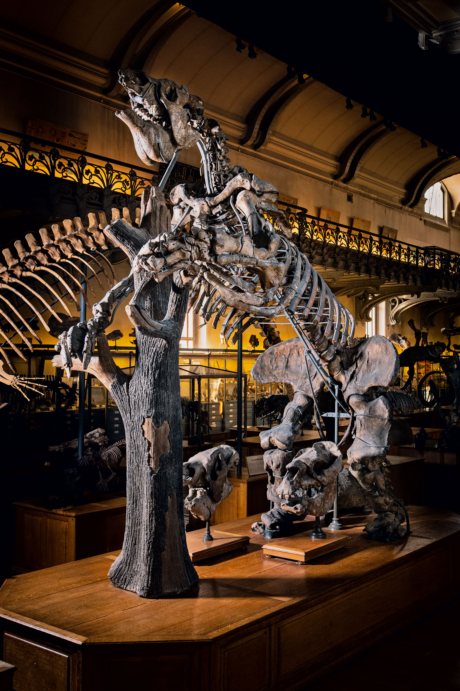

# Résumé étendu en Français {.unnumbered header-title="Résumé Étendu en Français"}

## Considérations préliminaires

En premier lieu, une justification s'impose: pourquoi s'intéresser à la biodiversité d'un continent si lointain ? Je vous invite pour cela à vous référer à la carte présentée dans la @fig-maps de l'introduction de ce manuscrit. Cette carte représente, à l'actuel, les nombres d'espèces par unité de surface (aussi appelé richesse spécifique) chez les mammifères terrestres (A), les oiseaux non-marins (B) et les amphibiens (C). Un contraste frappant s'impose alors à nous: l'Amérique du Sud se démarque par son immense richesse spécifique, quasiment supérieure à n'importe quelle autre région du globe. En cela, il est coutume de qualifier le continent sud-américain (et tout particulièrement sa partie tropicale, en première ligne de laquelle se trouve la fameuse forêt Amazonienne, voir @fig-physiography) de haut-lieu de biodiversité [@raven2020]. En réalité, pour une majorité de groupes d'organismes terrestres allant des plantes aux vertébrés en passant par les insectes, il apparaît que les zones les plus riches en espèces du globe sont inféodées à des latitudes tropicales, à savoir, les deux tiers Nord de l'Amérique du Sud, l'Afrique sub-saharienne et l'Asie du Sud-Est[^resume_fr-1]. L'origine de ce désequilibre notoire de biodiversité à la surface du globe n'a rien de trivial, et a intrigué des générations de scientifiques depuis les travaux fondateurs d'Alexander von Humboldt [*e*.*g*., @humboldt1807], d'Alfred R. Wallace [*e*.*g*., @wallace1876; @wallace1878] ou encore du célèbre Charles Darwin [*e*.*g*., @darwin1859].

[^resume_fr-1]: Cela dit, des différences notoires de richesse spécifique entre ces trois régions sont à reporter avec, en particlier, les diversités Africaines et sud-Amériaines différant grandement, la première étant, pour beaucoup de groupes, bien inférieure à la dernière. Bien que ce patron soulève moultes interrogations, nous ne nous attarderons pas dessus dans le cadre de ce travail. Si, toutefois, cette question vous intéresse, je ne peux que vous recommander de vous référer à cette étude parue il y a cinq ans, qui en dresse un joli contexte et propose un mécanisme clair pour l'expliquer, faisant usage des mêmes approches que celles utilisées dans le Chapitre [-@sec-chap3] de cette thèse: @hagen2021b.

Nous avons alors une première partie de réponse à la question initiale: la biodiversité mammalienne sud-américaine est particulièrement intéressante parce qu'elle est riche, plus riche que la plupart des autres régions du globe. Néanmoins, les choses deviennent encore plus intrigantes lorsque l'on met en perspective les mammifères sud-américains actuels et passés, ces derniers étant documentés dans les archives fossiles. Le registre fossile sud-américain regorge en effet de particularités qui lui sont propres et ayant suscité la curiosité des paléontologues dès les prémices de la discipline, à la fin du dix-huitième siècle. Georges Cuvier lui-même, référence incontestée dans l'art de l'anatomie comparée et père de la paléontologie, s'est intéressé à la question. Il décrira en 1796 le squelette complet d'un animal gigantesque ramené des plaines patagoniennes jusqu'à Madrid par les colons ibériques, qu'il nommera *Megatherium americanum* (littéralement, "la grosse bête américaine"). Sur la base de similarités morpho-anatomiques, il proposera alors une hypothèse folle: malgré ses six mètres de long et son mode de locomotion vraisemblablement terrestre, *Megatherium* est un paresseux. Un paresseux qui n'existe plus à l'heure actuelle. Les avancées conceptuelles du dix-neuvième siècle en matière de Théorie de l'Évolution (dont certaines sont rappelées dans l'introduction générale de ce manuscrit) permettront ensuite d'affirmer ce que subodorait déjà le paléontologue Français. Malgré l'abondance de restes fossilisés, si l'on ne retrouve plus de *Megatherium americanum* vivant à l'heure actuelle, c'est parce que cette espèce s'est éteinte. Les exemples d'espèces du registre fossile sud-américain dont on ne retrouve aucun équivalent actuel sont nombreux, et je ne peux, pour cela, que recommander la lecture de ce magifique ouvrage qui dresse un portrait varié et accessible de mammifères éteints ayant un jour peuplé l'Amérique du sud: @croft_horned_2016.

En cela, les mammifères sud-américains sont un modèle d'étude unique dont l'évolution appelle à des questionnements scientifiques particulièrement excitants.

```{r, echo=FALSE}
#| label: fig-megatherium
#| out-height: 9cm
#| fig-pos: "H"
#| fig-cap: "Le squelette complet de *Megatherium americanum* décrit par Cuvier en 1796 et exposé à la Galerie de Paléontologie et d'Anatomie Comparée du Muséum national d'Histoire naturelle, à Paris. &copy; MNHN-AGNES IATZOURA."



```

## Éléments de contexte

### Concepts

Les interrogations autour de \textcolor{Bittersweet}{l'hétérogénéité de la biodiversité} sont nombreuses, et à la base de pans entiers de recherche dans le domaine de la biologie évolutive. Cette hétérogénéité est avant tout \textcolor{Bittersweet}{spatiale}. En effet, comme évoqué au cours de la partie précédente, la richesse spécifique est loin d'être uniforme à la surface du globe. Certaines zones (principalement localisées sous des latitudes tropicales) sont en effet extrêmement riches en espèces, quand d'autres en sont extrêmement pauvres (*e*.*g*., régions polaires ou déserts). Cette hétérogénéité est aussi \textcolor{Bittersweet}{temporelle}. Les premières compilations d'espèces fossiles établies par @phillips1860, bien que géographiquement circonscrites au Royaume-Uni, ouvrirent la voie vers l'existence de fluctuations temporelles de richesse spécifique au cours du temps. Un siècle plus tard, les architectes de la "révolution paléobiologique", en première ligne desquels se trouvaient notamment Norman D. Newell, David M. Raup, J. John Sepkoski ou encore Stephen Jay Gould [@sepkoski2012] s'accordèrent à l'idée que, même en tenant compte des innombrables biais inhérents au registre fossile, les reconstructions de richesse spécifique au cours des temps géologiques exhibaient des fluctuations significatives. Ils convinrent ensuite que ces fluctuations ne pouvaient être expliquées par la seule action du hasard[^resume_fr-2], suggérant finalement que des causes extérieures devaient avoir été à l'œuvre pour expliquer les déclins et rebonds retranscrits par leurs études séminales [*e*.*g*., @sepkoski1981]. Enfin, l'hétérogénéité de la biodiversité se voit également \textcolor{Bittersweet}{entre \textit{clades}} (*i*.*e*., groupes d'espèces partageant une ascendance commune). En effet, certains clades sont énormément plus diversifiés que d'autres (quelques exemples sont proposés sur la @fig-DivDeseq), et comprendre l'origine de ce déséquilibre de diversité inter-clades continue d'être à la base de nombreux travaux en *macroévolution*.

[^resume_fr-2]: L'avènement de l'utilisation des méthodes statistiques en paléontologie, donnant finalement lieu à la naissance du domaine de la paléobiologie, a précipité une vague de remise en question légitime des patrons inférés à partir de données fossiles. Ainsi vit le jour la théorie de la *paléobiologie stochastique*, stipulant, sur la base d'arguments statistiques, qu'un grand nombre de caractéristiques des reconstructions de la biodiversité au cours du temps pouvait être reproduites à l'aide de modèles stochastiques n'incorporant aucune variable mécanistique -- *i*.*e*., dont les sorties sont juste dues au hasard [*e*.*g*., @gould1977; @raup1972]. Cette théorie fut ensuite invalidée, notamment par ses propres architectes, en première ligne desquels David M. Raup.

La macroévolution se définit comme l'étude des grandes tendances évolutives opérant au-delà de l'échelle de l'espèce (on parle d'échelon supra-spécifique), sur le temps long (typiquement, de l'ordre de plusieurs millions d'années). Elle se place alors en opposition à la microévolution, qui étudie des phénomènes évolutifs opérant au sein des espèces, dont la durée peut, en général, s'exprimer en générations et est typiquement inférieure au million d'années[^resume_fr-3]. Historiquement, les travaux en macroévolution se sont rangés en deux catégories: (1) ceux qui étudient l'évolution de la morphologie au sein d'un clade (c'est-à-dire, les "traits" phénotypiques au sens paléontologique, *cf*. \textcolor{Blue}{Glossary}) et (2) ceux qui étudient les dynamiques de diversification des clades au cours du temps, c'est-à-dire, l'équilibre net entre le nombre de lignées qui apparaissent (origination, ou spéciation dans le cas où l'unité d'étude est l'espèce) et qui disparaissent (extinction) par unité de temps [@hautmann2020; @saupe2021]. Dans le cadre de ce travail, la macroévolution sera principalement traitée dans le cadre de l'étude des dynamiques de diversification au cours du temps, mais voir cependant le Chapitre 2 pour une approche de l'évolution de la taille corporelle chez un groupe de rongeurs emblématique d'Amérique du Sud.

[^resume_fr-3]: La durée absolue des phénomènes étudiés en micro- (comme en macro-)évolution dépend en réalité du modèle d'étude biologique. Le repère arbitraire "*\< 1 Ma = microévolution et \> 1 Ma = macroévolution*" est surtout de mise pour les animaux et les plantes, mais n'a absolument aucun sens pour les unicellulaires (eucaryotes comme procaryotes) et les virus. En effet, avec un temps de génération de l'ordre de la vingtaine de minutes, en deux ans, environ 52560 générations de bactéries de la souche *Escherichia coli* se succèdent. Maintenant, si l'on considère que le temps de génération de l'Homme est de 25 ans, il faudrait 1.314 millions d'années pour atteindre le même nombre de générations. Au cours des 1.314 derniers millions d'années, plusieurs espèces du genre *Homo* sont apparues, ont co-existé et toutes se sont éteintes à l'exception de notre espèce *Homo sapiens* [@wood2008]. Les phénomènes implicites dont il est ici fait mention -- spéciation et extinction -- sont typiquement de l'ordre de la macroévolution. Ainsi, les concepts et les méthodologies macroévolutifs sont applicables aux bactéries comme *E. coli* pour des durées de l'ordre de l'année.

L'hétérogénéité spatiale, temporelle et inter-clades de la richesse spécifique, évoquée au cours du premier paragraphe, suggère que les intensités auxquelles s'opèrent les processus d'apparition et d'extinction des lignées (à savoir, les taux d'origination et d'extinction, *i*.*e*., taux de diversification) varient selon ces trois dimensions. Un point central de la macroévolution est alors d'élucider les facteurs qui sous-tendent ces variations. Deux modèles sont généralement invoqués afin de répondre à ces questions. Dans son interprétation moderne, l'hypothèse de la \textcolor{Bittersweet}{\textit{Reine Rouge}} [@vanvalen1973], dont le nom est issu du célèbre roman de Lewis Carroll *De l'autre côté du miroir*, postule que les interactions entre espèces (aussi appelées *interactions biotiques*, *e*.*g*., mutualisme, prédation, compétition, etc.) sont le principal moteur des changements évolutifs. À l'inverse, le modèle du \textcolor{Bittersweet}{\textit{Fou du Roi}} [@barnosky2001] stipule que les changements macroévolutifs émergent principalement de facteurs du milieu physique, ou facteurs *abiotiques* (*e*.*g*., climat, élévation d'une montagne, météorite, etc.). Un bon nombre d'études a en réalité illustré que ces deux théories fondatrices ne sont pas mutuellement exclusives, et que les dynamiques macroévolutives de beaucoup de groupes sont en fait le produit de facteurs biotiques et abiotiques [*e*.*g*., @condamine2018; @lagomarsino2016; @nascimento2025].

### Les mammifères sud-américains au cours du Cénozoïques

Il y a près de 66 millions d'années, une conjecture de bouleversements environnementaux[^resume_fr-4] causa -- entre autres -- l'extinction des célèbres dinosaures non-aviens[^resume_fr-5]. Cet événement, reconnu comme faisant partie des cinq crises majeures d'extinction de masse ayant impacté la biodiversité au cours de l'éon Phanérozoïque [*i*.*e*., les 540 derniers millions d'années, @sepkoski1981], marqua l'avènement de l'*âge des mammifères*, à savoir, l'ère Cénozoïque (*i*.*e*., 66 derniers millions d'années). À peu près au même moment débuta "l'isolement splendide" de l'Amérique du Sud, comme qualifié par George G. Simpson, célèbre paléontologue étasunien ayant dédié une part significative de sa carrière à l'étude des faunes éteintes d'Amérique du Sud [@simpson1980]. Par le jeu de la tectonique des plaques, au cours de la plupart du Cénozoïque, l'Amérique du Sud fut en effet quasiment dépourvue de toute connexion physique avec les autres continents, un peu à la manière de l'Australie actuellement. Par conséquent, les faunes prisonnières de ce continent insulaire évoluèrent en vase clos, donnant lieu à un fort degré d'*endémisme*, c'est-à-dire, de lignées évolutives n'ayant émergé que sur cette masse continentale. Simpson proposa que les faunes mammaliennes sud-américaines pouvaient se résumer par trois strates temporelles distinctes (@fig-SALMA).

[^resume_fr-4]: Les deux causes prévalentes pour expliquer cette crise d'extinction de massent impliquent l'impact d'un astéroïde et un volcanisme intense causé par le déplacement de la plaque Indienne. Ces deux causes ont fait l'objet de grands débats, qui dépassent le cadre de ce travail [*e*.*g*., @archibald2010 @chiarenza2020; @schulte2010].

[^resume_fr-5]: Aussi surprenant que cela puisse paraître, les oiseaux sont en réalité des dinosaures [*e*.*g*., @brusatte2015]. En cela ils représentent le seul groupe de dinosaures ayant survécu au tragique impact de la météorite, ayant décimé tous les autres dinosaures.

La première strate de Simpson, la plus ancienne (s'étendant sur une période couvrant de 66 à environ 40 millions d'années [Ma] avant notre ère), comprend la radiation basale des lignées natives du continent, emprisonnées par son isolation. Celles-ci comprennent trois grands groupes, que Simpson avait coutume d'appeler *Old-Timers* (c'est-à-dire, les "anciens", @fig-persistence). On y retrouve les \textcolor{Bittersweet}{ongulés natifs sud-américains} (SANU en anglais), incluant un grand nombre de lignées qui florirent durant tout le Cénozoïque avant de s'éteindre il y a quelques milliers d'années (un clin d'œil à l'échelle des temps géologiques: il est probable que les derniers représentants des SANU aient cotôyé les premiers hommes ayant atteint l'Amérique du Sud) [@croft2020]. Les figures les plus emblématique de ce groupe mystérieux sont sans doute *Toxodon platensis*, du gabarit d'un hippopotame actuel, ou encore *Macrauchenia patachonica*, souvent figuré comme un lama géant avec une trompe[^resume_fr-6]. Des études basées sur des comparaisons de séquences de protéines anciennes retrouvées dans des restes exceptionnellement bien préservés de ces deux espèces avec des séquences d'espèces actuelles ont montré que les SANU sont en réalité des cousins de l'ordre des Périssodactyles, incluant les actuels chevaux, tapirs et rhinocéros [@buckley2015; @welker2015]. Un deuxième groupe emblématique de mammifères caractéristiques de la première strate de Simpson est les \textcolor{Bittersweet}{xénarthres}. Contrairement aux SANU, les xénarthres ne sont pas éteints: ils sont actuellement représentés par les tatous, les paresseux, et les fourmiliers[^resume_fr-7]. À l'exception de ces derniers, dont le registre fossile est extrêmement parcellaire, les xénarthres sont abondamment représentés dans le registre fossile à partir de 53 millions d'années avant notre ère (faune d'Itaboraí, au Brésil, @fig-persistence). Ces archives minérales permettent de documenter que les xénarthres ont connu des extinctions substantielles au cours de leur histoire évolutive. Un groupe entier de cousins des tatous, les glyptodons[^resume_fr-8], aussi qualifiés de "tatous à armure", s'est éteint il y a quelques milliers d'années [@delsuc2016]. Chez les paresseux, les deux genres actuels assujettis au milieu arboricole (les paresseux à deux et trois doigts) sont en fait les survivants d'un groupe beaucoup plus diversifié dans le passé, incluant un grand nombre de formes terrestres de grande taille (à l'image de *Megatherium*), et même un genre possiblement semi-aquatique [@boscaini2025; @tejada2024]. Enfin, le troisième grand groupe caractéristique de la première strate de Simpson est le seul à ne pas se retrouver exclusivement sur le continent sud-américain: il s'agit des \textcolor{Bittersweet}{métathériens} [@goin2016]. Ce groupe de mammifères est aujourd'hui représenté par les marsupiaux, bien connus en Australie (*e*.*g*., kangourous, wombats, koalas, etc.). Les marsupiaux se retrouvent toutefois également dans les Amériques. Ils y sont aujourd'hui représentés par les opossums et leurs apparentés, ainsi que deux autres clades dont les richesses spécifiques sont un peu plus anecdotiques (@fig-persistence A). Les archives fossiles attestent de la place centrale des métathériens dans les faunes passées d'Amérique du Sud, avec notamment un ordre de prédateurs, les sparassodontes [*e*.*g*., @forasiepi2009], dont certains représentants ont évolué des dents de sabre, de manière totalement convergente aux célèbres tigres à dent de sabre (félins).

[^resume_fr-6]: Une représentation populaire de *Macrauchenia* est issue de *L'Âge de Glace*, voir <https://iceage.fandom.com/wiki/Freaky_mammal>

[^resume_fr-7]: Attention, les fourmiliers (Xenarthra: Vermilingua) ne sont pas apparentés aux pangolins (Pholidota), bien que ces deux groupes partagent des similitudes morphologiques (par exemple, un museau allongé et un longue langue). Ils sont un exemple de *convergence évolutive*, c'est-à-dire qu'ils ont acquis des caractères morphologiques similaires de façon indépendante sans être directement apparentés, sous l'effet d'une pression sélective commune (ici, la consommation de fourmis).

[^resume_fr-8]: Les glyptodons se retrouvent eux aussi dans *L'Âge de Glace*: <https://iceage.fandom.com/wiki/Glyptodon>

La seconde strate de Simpson, s'étendant de la fin de l'Éocène moyen jusqu'à la fin du Miocène (soit environ de 40 à 5 Ma) se distingue de la précédente par deux aspects majeurs. Premièrement, les trois groupes endémiques décrits dans le paragraphe précédent connurent d'importantes innovations morphologiques, si bien que l'on parle de "\textcolor{Bittersweet}{modernisation faunistique}" [*e*.*g*., @croft2008]. En parallèle, le commencement de cette seconde strate fut ponctué par l'une des plus grandes énigmes de l'histoires des faunes mammaliennes sud-américaines, \textcolor{Bittersweet}{l'apparition des primates anthropoïdes et des rongeurs hystricognathes} dans le registre fossile (@fig-SALMA). Cette apparition a longtemps interrogé les paléontologues, et pour cause, il a très vite été établi avec certitude que ces groupes étaient absents du continent au moment où celui-ci débuta son "splendide isolement", à l'aube du Cénozoïque [@simpson1950]. Des décennies de découvertes paléontologiques [*e*.*g*., @antoine2012; @bond2015; @marivaux2002; -@marivaux2023; @seiffert2020] combinées aux progrès en matière de reconstruction des relations de parenté entre espèces sur la base de séquences moléculaires (ADN ou protéines; on parle de *phylogénie moléculaire*) [*e*.*g*., @poux2006] ont permi d'attester que, aussi insolite que cela puisse paraître, ces groupes sont issus de lignées d'affinité Afro-Asiatique qui auraient traversé l'Océan Atlantique au cours de l'Éocène ! Le mystère des moyens techniques ayant permis cette spectaculaire traversée reste entier, et ne sera probablement jamais entièrement résolu. Il semble en effet naturel qu'à cette époque, les singes et les rongeurs ne disposaient ni de bateau, ni d'avions, et étaient bien incapables de nager sur de telles distances (on parle de mille kilomètres au bas mot). Le modèle qui semble le plus vraisemblable est celui du *radeau* (aussi parfois appelé *île flottante*). @marivaux2023 proposa en effet qu'à la faveur d'épisodes météorologiques exceptionnels ayant pu survenir au cours de l'optimum climatique de l'Éocène moyen (MECO, @fig-SALMA), des lambeaux de terre issus de zones estuarines d'Afrique tropicale ont pu se décrocher, pouvant servir de moyen de transport pour des mammifères de petite taille peuplant les communautés ripisylves locales, comme les primates et les rongeurs de l'époque. Des modélisations de courants atmosphériques et océaniques semblent valider la prévalence de mouvements Est-Ouest à ce moment-là, allant dans le sens de cette traversée insolite [@houle1999; @montheil2025].

Enfin, la troisième strate de Simpson, allant du Pliocène à l'actuel (couvrant environ les cinq derniers millions d'années), contient les derniers jalons ayant façonné les faunes de sud-américaines jusqu'à donner ce qu'elles sont actuellement. Cette strate englobe un bouleversement majeur dans leur architecture, survenu alors que la fermeture complète de l'Isthme de Panama mit un terme à l'isolement de l'Amérique du Sud en établissant une connexion physique pérenne entre les Amériques[^resume_fr-9], il y a à peu près 3.5 millions d'années [@jaramillo2018; @odea2016]. Cet événement géologique précipita l'admixture entre les faunes de mammifères terrestres des deux continents, un événement aussi connu sous le nom de \textcolor{Bittersweet}{Grand Échange Biotique inter-Américain} (souvent abbrévié *GABI* en anglais) [@marshall1982; @webb1985]. Ainsi, lamas, tapirs, peccaris, carnivores (léopards, renards, ours, raton-laveurs, etc.), chevaux et gomphothères (cousins des éléphants) se retrouvèrent en Amérique du Sud, et réciproquement, paresseux géants, glyptodons, tatous et opossums cheminèrent dans le sens opposé, jusqu'en Amérique du Nord (@fig-GABI). Chez les mammifères, cet échange faunistique est loin d'avoir été symétrique. Il a en effet largement profité aux espèces d'origine nord-américaine au détriment des espèces endémiques de l'Amérique du Sud, si bien qu'actuellement, 50% des genres vivant en Amérique du Sud ont une ascendance nord-américaine, alors que seulement 10% des genres d'Amérique du Nord ont une ascendance sud-américaine [@webb1991]. Les raisons de ce déséquilibre notoire de colonisation entre les faunes des deux continents demeurent, encore aujourd'hui, non-résolues [*e*.*g*., @bacon2016; @carrillo2020; @faurby_asymmetry_2016; @freitas-oliveira2025; @woodburne2010]. Enfin, quelques millions d'années après l'initiation du GABI, s'abattit sur le continent sud-américain le fléau des \textcolor{Bittersweet}{extinctions Quaternaire de la mégafaune}. Ainsi s'éteignirent bon nombre d'espèces de grande taille à l'échelle mondiale, et on pense que ces vagues d'extinction -- pour certains regardées en partie comme l'œuvre de l'homme --, eurent raison de beaucoup de géants emblématiques des faunes éteintes de l'Amérique du Sud [@svenning2024].

[^resume_fr-9]: Tout au long de cet essai, il sera fait référence d' "Amérique du Nord" pour en réalité qualifier l'Amérique du Nord et l'Amérique Centrale.

### Objectifs de cette thèse

Cette thèse s'articule en trois axes ayant pour but d'améliorer la compréhension des dynamiques évolutives des mammifères sud-américains à des moments clé de leur histoire. En premier lieu, un regard sera porté sur l'impact d'un bouleversement climatique majeur suvenu à l'échelle globale il y a environ 34 millions d'années (*i*.*e*., la transition Éocène--Oligocène) sur les faunes de mammifères d'Amérique du Sud de l'époque. Ensuite, nous nous intéresserons à un groupe de rongeurs insolites, les chinchilloïdes. Nous essayerons de mettre en lumière les facteurs à l'origine de l'évolution phénotypique spectaculaire ayant opéré chez ce clade -- ayant atteint les plus grandes tailles jamais enregistrées chez des rongeurs -- et de leur déclin récent documenté dans les archives fossiles, au moyen d'outils quantitatifs modernes. Enfin, à l'aide d'un simulateur de biodiversité, nous nous interrogerons sur l'implication des variations climatiques des cinq derniers millions d'années dans la mise en place de l'asymétrie du GABI introduite plus haut.

## Chapitre 1. Comment la perturbation climatique la plus marquée du Cénozoïque, la transition Éocène--Oligocène (*ca.* 34 Ma), a-t-elle impacté les faunes mammaliennes endémiques de l'Amérique du Sud ?

Non-loin de la limite entre les strates 1 et 2 de Simpson, il y a 33.9 millions d'années, la Terre connut son bouleversement climatique le plus brutal depuis l'impact de la météorite ayant eu lieu 32 millions d'années plus tôt. Cet événement, la transition Éocène--Oligocène (*EOT*, du nom des deux époques géologiques qu'il chevauche), se caractérisa par la mise en place du courant circumpolaire Antarctique, précipitant la glaciation intégrale du continent polaire [@coxall2007; @liu2009; @toumoulin2022]. Il serait question d'une chute globale de température de 2.5°C en l'espace de quelques centaines de milliers d'années[^resume_fr-10] [@westerhold2020]. Cet événement a été relié à des réorganisations faunistiques majeures, d'abord documentées dans le registre fossile des mammifères terrestres Européens. En effet, au même moment eut lieu ce que @stehlin1909 baptisa la *Grande Coupure*: les espèces endémiques d'Europe de l'Ouest furent marquées par des vagues d'extinction majeures et supplantées par des lignées d'origine Asiatique [@weppe2023]. Des vagues d'extinction de grande ampleur sont également documentées chez les mammifères dans d'autres parties de l'Hémisphère Nord, comme l'Asie [*e*.*g*., @meng1998] ou l'Amérique du Nord [*e*.*g*., @stucky2014]. Toutefois, avant ce travail doctoral, l'impact de l'EOT sur les faunes mammaliennes d'Amérique du Sud n'avait jamais été quantifié de manière intégrative, mais plutôt postulé sur la base de quelques localités patagoniennes éparses [*e*.*g*., @goin2010].

[^resume_fr-10]: Notez cependant la différence d'ordre de grandeur avec le changement climatique actuel. Le rapport du GIEC paru en 2023 faisait état d'une hausse durable de la température à la surface du globe de +1.1°C de 2011 à 2020 par rapport aux niveaux pré-industriels (1850--1900). Leurs projections les plus optimistes, issues de modèles où les États implémenteraient à la lettre les recommendations du panel en matière de réduction des émissions de gaz à effet de serre, limitent ce réchauffement à +2°C à la fin du siècle, tandis que les plus pessimistes, où rien ne change dans notre mode de consommation, indiquent un réchauffement pouvant aller jusqu'à +8.5°C [@ipcc2023]. En deux siècles, le changement climatique lié aux activité humaines fera ce qui a pris 1000 fois plus longtemps au moment de l'EOT, déjà considérée comme un bouleversement climatique majeur. Du jamais vu à l'échelle de l'histoire de la vie, ce qui a de quoi alimenter de sérieuses préoccupations.

Ce premier chapitre cherchera alors à répondre aux questions suivantes:

- *L'EOT peut-elle être considérée comme une crise d'extinction de masse en Amérique du Sud, comme suggéré en Europe [e.g., @weppe2023] ?*
- *Les changements dans l'architecture des assemblages faunistiques sud-américains suite à la transition entre les phases 1 et 2 de Simpson ont-ils été homogènes sur le plan taxonomique, fonctionnel et géographique ? En particulier, les assemblages tropicaux ont-ils été impactés de la même façon que les extra-tropicaux ?*
- *Peut-on retrouver un signal du refroidissement global ayant eu lieu à l'EOT dans les dynamiques de diversification des mammifères sud-américains ? Ces dynamiques furent-elles impactées par d'autres paramètres environnementaux ?*

Avec l'aide précieuse de paléontologues ayant une expertise poussée sur un grand nombre de groupes, un jeu de données exhaustif et inédit d'occurrences fossiles de mammifères sud-américains sur une période couvrant de 56 à 23.04 Ma (*i*.*e*., l'intégralité des époques Éocène et Oligocène) a été assemblé à partir d'occurrences déjà publiées et rentrées dans la base de données *The Paleobiology Database*[^resume_fr-11]. Ce jeu de données a par la suite été intensément révisé et complété sur la base d'une revue de la littérature et des données de terrain de l'équipe. La matrice finale d'occurrences inclut 3378 occurrences pour 1115 espèces et 536 genres. Une inférence Bayésienne jointe des dynamiques de diversité et de diversification (*i*.*e*., taux d'origination et d'extinction) des mammifères au cours de la période d'étude a ensuite été effectuée à partir de ces données, tenant compte d'un certain nombre de biais du registre fossile, à l'aide du logiciel PyRate [@silvestro2014; -@silvestro_bayesian_2014; -@silvestro_improved_2019]. Ces analyses ont par la suite été discriminées par latitude pour isoler les dynamiques de diversification des assemblages tropicaux et extra-tropicaux séparément, et par écomorphotypes dentaires -- donnant un indice sur la position des taxons en question dans l'écosystème. Enfin, ces analyses ont été complétées par des analyses multivariées établissant des dépendances entre les taux de diversifications inférés à l'aide du registre fossile et une sélection de variables environnementales.

[^resume_fr-11]: <https://paleobiodb.org/>

Nos résultats suggèrent une absence de pic d'extinction au moment de l'EOT, invalidant par conséquent l'hypothèse d'une extinction de masse chez les mammifères sud-américains à ce moment-là de leur histoire évolutive. Nos analyses mettent plutôt en évidence une baisse graduelle de diversité au cours de l'Éocène, très probablement médiée par la baisse graduelle de température au cours de l'Éocène, les prémices de l'élévation Andine et des effets de diversité-dépendance. Une hausse jointe des taux d'origination et d'extinction est à reporter à la fin de l'Éocène moyen, suggérant l'amorce d'un renouvellement faunistique que nos analyses identifieront comme fonctionnellement homogène (*i*.*e*., pas plus intense pour un niveau écologique qu'un autre). À l'Oligocène, les dynamiques de diversification des mammifères sud-américains demeurent impactées par la surrection Andine et des effets de diversité-dépendance, mais l'effet de la température n'est plus retrouvé. De manière intéressante, nos résultats suggèrent que les faunes tropicales et extra-tropicales ont eu des dynamiques macroévolutives très différentes au cours de la période d'étude. Les assemblages tropicaux exhibent en effet une certaine stabilité macroévolutive (absence de variation des taux d'origination et d'extinction) alors que des variations de taux marquées sont à reporter au sein des assemblages extra-tropicaux. Ce résultat offre du corps à l'hypothèse de *stabilité tropicale* proposée par nul autre que @wallace1876, postulant que, du fait de la stabilité des climats tropicaux au cours du temps (*i*.*e*., conditions climatiques peu fluctuantes), il est attendu que les dynamiques de diversification des taxons tropicaux soient elles aussi plus stables qu'ailleurs.

Ce travail propose alors des perspective intéressantes sur les interactions entre biodiversité et climat au cours des temps profonds en déconstruisant le paradigme d'une extinction de masse généralisée à l'EOT chez les mammifères, soulignant l'importance de considérer les particularités régionales dans l'étude de patrons évolutifs à l'échelle globale. Il apporte également un résultat important en validant la stabilité macroévolutive des tropiques sud-américaines au cours des temps géologiques.

## Chapitre 2. Parfois, c'est la taille qui compte : un décodage quantitatif de la fascinante histoire évolutive des plus gros rongeurs ayant jamais existé

Alors que le chapitre précédent faisait une étude intégrative à l'échelle de tous les mammifères, ce chapitre se restreint à l'étude d'un groupe en particulier: les rongeurs chinchilloïdes. Ce clade comprend huit espèces actuelles de taille modérée, qui se regroupent en deux familles dont la parenté est relativement lointaine. La famille des chinchillidés inclut, comme son nom l'indique, les chinchillas, mais également les viscaches (dont la ressemblance avec des lapins peut parfois troubler, à noter que les lapins ne sont pas des rongeurs) et le viscache des plaines. La famille des dinomyidés, moins connue, ne comprend qu'un seul représentant actuel (on parle de famille *monotypique*): le pacarana (des illustrations de ces petites bêtes sont disponibles sur la @fig-context).

Les chinchilloïdes sont richement documentés dans les archives fossiles [*e*.*g*., @candela2005; @vucetich2015]. De façon spectaculaire, leur registre fossile comprend les plus gros rongeurs jamais enregistrés. Ceux-ci incluent l'emblématique *Josephoartigasia monesi*, issu du Pleistocène Uruguayen, dont les premières estimations de masse corporelle avoisinaient la tonne [*e*.*g*., @rinderknecht2008] avant d'être revues à la baisse à "juste" 250 kg [@boivin2024], surpassant tout de même d'un facteur cinq la masse corporelle du plus gros rongeur actuel, le capybara[^resume_fr-12]. Le registre fossile des chinchilloïdes témoigne également d'une richesse spécifique passée autrement supérieure à la richesse actuelle, suggérant que ce groupe a connu un déclin (@fig-context).

[^resume_fr-12]: Le capybara (*Hydrochoerus hydrochaeris*) appartient, au même titre que les chinchilloïdes, à la radiations des rongeurs caviomorphes (endémique du continent sud-américain). Il est toutefois membre d'une autre superfamille, celle des cavioïdes (*cf*. @fig-context).

Ce chapitre vise alors à contribuer à la compréhension des dynamiques macroévolutives des chinchilloïdes au travers des problématiques suivantes:

- *L'accroissement de la taille corporelle chez les chinchilloïdes fut-il accompagné de variations dans leurs taux de diversification (i.e., diversification trait-dépendante) ?*
- *Le déclin des chinchilloïdes a-t-il été causé par une hausse de leur taux d'extinction, une baisse de leur taux d'origination, ou les deux à la fois ?*
- *Le déclin des chinchilloïdes a-t-il été sélectif envers des phénotypes particuliers, et notamment, ce déclin a-t-il affecté uniformément toutes les classes de masse corporelle ?*
- *L'évolution paléoenvironnementale de la fin du Cénozoïque a-t-elle affecté les possibles interactions entre diversité spécifique et disparité morphologique à l'échelle du clade ? Si oui, quelle(s) variable(s) et par quel(s) procédé(s) ?*

Au cours de ce chapitre, un jeu de données d'occurrences fossiles inédit a été assemblé à la manière du chapitre précédent, à savoir, à partir de données en ligne révisées avec soin et complétées par une revue de la littérature. Étant donné que la plupart des espèces actuelles ne sont pas représentées dans le registre fossile, une nouvelle méthode d'incorporation d'occurrences simulées de ces espèces reposant sur leurs âges de divergence issus d'une phylogénie datée a été mise au point. Cette matrice d'occurences combinée a ensuite été analysée à l'aide de méthodologies macroévolutives à la pointe reposant soit sur un cadre probabiliste, du *deep-learning*, ou une combinaison des deux pour reconstituer les dynamiques de diversité et de diversification du groupe en tenant compte d'un certain nombre de biais inhérents au registre fossile. En parallèle, des reconstructions de traits (masse corporelle et hauteur de couronne des dents jugales, ou *hypsodontie*) issues de mesures cranio-dentaires ont été conduites pour la majorité des espèces présente dans notre jeu de données afin d'évaluer, après incorporation de proxys environnementaux pertinents, les facteurs les plus susceptibles d'avoir influencé la diversification du groupe (*i*.*e*., diversification trait- et environnement-dépendante). Ce travail présente la matrice d'occurrences et les acquisistions phénotypiques les plus complètes jamais assemblées pour un groupe de rongeurs caviomorphes.

Nos résultats corroborent une tendance longtemps suggérée par des observations issues du registre fossile, à savoir que les dynamiques de diversité spécifique et de disparité morphologique selon l'axe de la taille corporelle sont couplées chez les chinchilloïdes. Les deux quantités tendent en effet à la hausse depuis l'émergence du groupe jusqu'à la fin du Miocène (environ 6 Ma), où elles chutent toutes deux de façon jointe. Nos analyses révèlent une absence de variation de taux de spéciation au cours de l'histoire évolutive du groupe. Par contre, le taux d'extinction exhibe une hausse significative à la fin du Miocène, suggérant alors que le déclin des chinchilloïdes est dû à un changement dans leur régime d'extinction. Cette hausse du régime d'extinction est sélective envers les espèces de grande taille et habitant des hautes latitudes (typiquement, hors des tropiques), et serait possiblement médiée par l'orogénèse Andine et les variations du niveau marin. Ces résultats suggèrent que la disparition des grandes zones humides sud-américaines (*cf*. @fig-SALMA) au Miocène Supérieur aurait joué un rôle clé dans le déclin sélectif des chinchilloïdes, les espèces de grande taille étant en général vues comme inféodées à un mode de vie semi-aquatique.

## Chapitre 3. De l'implication du climat dans l'asymétrie du Grand Échange Biotique inter-Américain: apports d'un simulateur de biodiversité

Le dernier chapitre de ce travail doctoral porte sur l'émergence de l'asymétrie du Grand Échange Biotique inter-Américain (souvent abbrévié *GABI*, l'anagramme de son nom anglais). Comme énoncé dans la section introductive, le GABI caractérise l'échange faunistique entre les Amériques survenu à la fin du Cénozoïque, catalysé par la fermeture complète de l'Isthme de Panama, il y a environ 3.5 millions d'années[^resume_fr-13] [@marshall1982; @webb1985]. Chez les mammifères terrestres, cet échange faunsistique est loin d'avoir été réciproque: aujourd'hui, les espèces d'origine nord-américaine en Amérique du Sud sont disproportionnellement représentées par rapport aux espèces d'origine sud-américaines en Amérique du Nord. Les causes de ce désequilibre notable de succès de colonisation du continent voisin demeurent encore peu élucidées, en dépit de l'attrait scientifique que la question a généré depuis des décennies. Deux grandes catégories d'hypothèses ont été formulées à ce propos. Historiquement, ce désequilibre a été vu comme la résultante d'*interactions biotiques*, avec l'idée prépondérante que les espèces d'Amérique du Nord ont été compétitivement supérieures à celles d'Amérique du Sud [*e*.*g*., @simpson1950]. Toutefois, des études récentes, notamment conduites à partir du registre fossile des sparassodontes, ont apporté des preuves allant à l'encontre d'une telle hypothèse [*e*.*g*., @freitas-oliveira_no_2024; @pino2022; @tarquini2022]. Cela dit, une étude datée d'il y a dix ans a suggéré la possible implication d'une autre forme d'interactions biotiques dans l'asymétrie du GABI: la prédation [@faurby_asymmetry_2016]. La deuxième grande catégorie d'hypothèses formulées en vue d'expliquer l'émergence d'un tel désequilibre biogéographique fait référence à l'implication de *facteurs abiotiques*, et notamment le climat [@vrba1992; @webb1991]. Les possibles mécanismes par lesquels le climat a pu générer l'asymmétrie du GABI sont récapitulés dans la @fig-hypotheses. Des travaux récents sont venus apporter du corps à cette hypothèse [*e*.*g*., @freitas-oliveira_temperature_2024; @freitas-oliveira2025].

[^resume_fr-13]: L'âge de 3.5 Ma, souvent utilisé comme âge de référence pour la fermeture complète de l'Isthme, a été remis en question par des études mettant en exergue des preuves biologiques pour montrer que cette fermeture a possiblement été antérieure [@bacon2015]. Ces résultats ont été débattus dans la littérature [*e*.*g*., @lessios2015; @marko2015]. Des travaux ultérieurs combinants approches biologiques et géologiques en ont conclu que cet âge pouvait toujours être considéré comme valide, mais que toutefois, la cessation de circulation d'eaux profondes dans la zone a été bien antérieure (autour de 13 Ma), suggérant un amenuisement graduel de l'imperméabilité du passage à la dispersion d'animaux terrestres avant sa fermeture complète [@jaramillo2018; @odea2016].

Les études testant les hypothèses derrière la mise en place de l'asymétrie du GABI se sont, jusqu'à lors, contentées d'approches corrélatives appliquées à des données empiriques -- principalement des fossiles, dont les biais sont, on le sait, très nombreux (*cf*. @sec-FossilBias). Néanmoins, ces hypothèses n'ont jamais été testées *in silico* à l'aide d'approches visant à étudier l'émergence de la biodiversité en réponse à des facteurs éco-évolutifs au moyen de simulations [*e*.*g*., @hagen2023]. L'objectif de ce chapitre est alors de tester l'implication des fluctuations paléoclimatiques dans l'émergence de l'asymmétrie du GABI de manière mécanistique, s'affranchissant alors des biais usuels des études empiriques. À l'aide du modèle *gen3sis* [@hagen2021], à partir de reconstructions à haute résolution des variations de températures et précipitations annuelles au sein des Amériques au cours des cinq derniers millions d'années [@holden2019], nous avons simulé des espèces virtuelles dont la capacité à survivre et à s'établir localement ne dépendait que du climat. Ces simulations débutaient soit d'Amérique du Nord, soit d'Amérique du Sud (500 simulations dans chaque condition), et la proportion de simulations amenant à la colonisation du continent voisin a été quantifiée dans chacun des deux cas. À notre connaissance, cette étude est la première à investiguer les facteurs à l'origine de l'asymmétrie du GABI au moyen d'approches mécanistiques.

De façon surprenante, contrairement aux prédictions des hypothèses testées, à l'issue des 500 réplicats dans chacune des deux conditions initiales (*i*.*e*., départ d'Amérique du Nord ou d'Amérique du Sud), les résultats révèlent que la proportion de simulations conduisant à un échange Sud$\rightarrow$Nord est significativement supérieure à celles conduisant à un échange Nord$\rightarrow$Sud. La plupart de ces échanges ont lieu au sein du biome tropical, contrairement à ce qu'indique le registre fossile, où les espèces inféodées à des climats plus tempérés sont sur-représentées. Ce résultat questionne la validité de se restreindre au registre fossile pour comprendre l'émergence de l'asymétrie du GABI, ces archives minérales étant certainement très affectées par des biais de préservation à l'échelle des régions tropicales (@sec-PalChal). Par conséquent, au regard de nos simulations, les dynamiques paléoclimatiques seules ne peuvent expliquer l'asymétrie du GABI, ce qui suggère l'implication d'autres facteurs dans l'émergence de cette énigme dans l'histoire des faunes récentes des Amériques.



```{=latex}
\includepdf[pages=-, scale=1]{./Fioritures/Shapaja.pdf}
```



```{=latex}
\includepdf[pages=-, scale=1]{./Fioritures/General_intro.pdf}
```



::: {.content-visible unless-format="pdf"}
Cette question peut se décomposer en deux classes de sous-questions. La première porte sur le *pourquoi* évolutif [*e*.*g*., @jablonski2006; @stebbins1974]. Les tropiques sont-elles plus riches en espèces parce que celles-ci s'y éteignent moins facilement qu'à l'extérieur des tropiques (hypothèse du 'musée tropical', où sont 'conservées' les espèces en y perdurant plus longtemps qu'autre part) ? Parce que les lignées y trouvent davantage d'opportunités pour diversifier (hypothèse du 'berceau tropical', où naissent les espèces) ? Les deux à la fois ? La seconde classe de sous-questions visant à expliquer ce patron spatial porte sur le *comment*: quels sont les propriétés propres aux milieux tropicaux qui les rendent aussi riches en espèces ? En dépit de sa caractérisation précoce (fin du dix-neuvième siècle) et de l'effort de recherche qu'il a suscité [*e*.*g*., @meseguer2020; @mittelbach2007; @schemske2009; @rolland2014; @tietje2022; @quintero2024], ce désequilibre de richesse spécifique latitudinal, souvent nommé gradient latitudinal de diversité, demeure emplein de zones d'ombre, qui en font une thématique de recherche centrale aux domaines de la macroécologie et la macroévolution (d'où né la dénomination barbare de "perspective macro-éco-évolutive" que vous trouverez dans le titre de cette thèse).
:::
